# Architecture Reference

> Deep technical architecture documentation for the Drone Ground Station system.

---

## 1. System Overview (C4 Model)

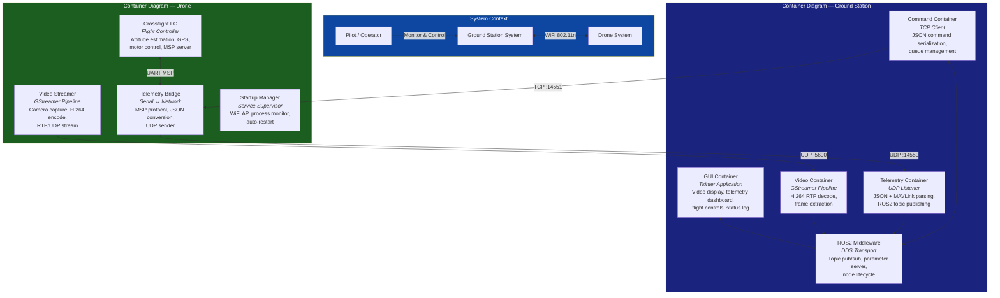

---

## 2. Component Deep Dive

### 2.1 TelemetryReceiver (Ground Station)

**Purpose**: Receive and parse telemetry data from drone, publish as ROS2 messages.

**Internal Architecture**:
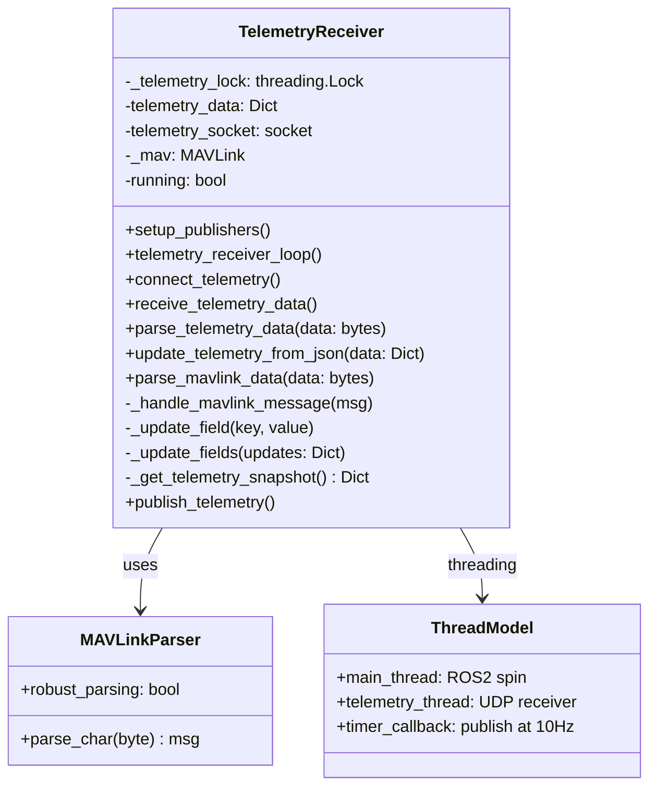

**Thread Model**:
- **Main thread**: ROS2 executor (`rclpy.spin`) — runs timer callbacks
- **Telemetry thread** (daemon): Blocks on `socket.recvfrom()`, parses data, updates shared state
- **Lock**: `_telemetry_lock` protects `telemetry_data` dict

**Supported MAVLink Messages**:

| Message | ID | Fields Extracted |
|---------|-----|-----------------|
| HEARTBEAT | 0 | `base_mode` (armed flag), `custom_mode` (flight mode) |
| SYS_STATUS | 1 | `voltage_battery`, `current_battery`, `battery_remaining` |
| GPS_RAW_INT | 24 | `lat`, `lon`, `alt`, `satellites_visible`, `fix_type`, `vel`, `cog` |
| ATTITUDE | 30 | `roll`, `pitch`, `yaw` (radians) |
| GLOBAL_POSITION_INT | 33 | `lat`, `lon`, `relative_alt`, `hdg` |
| VFR_HUD | 74 | `groundspeed`, `alt`, `heading` |
| BATTERY_STATUS | 147 | `voltages[]`, `current_battery`, `battery_remaining` |

### 2.2 MAVLinkBridge (Ground Station)

**Purpose**: Receive flight commands from ROS2 topics, serialize as JSON, send to drone via TCP.

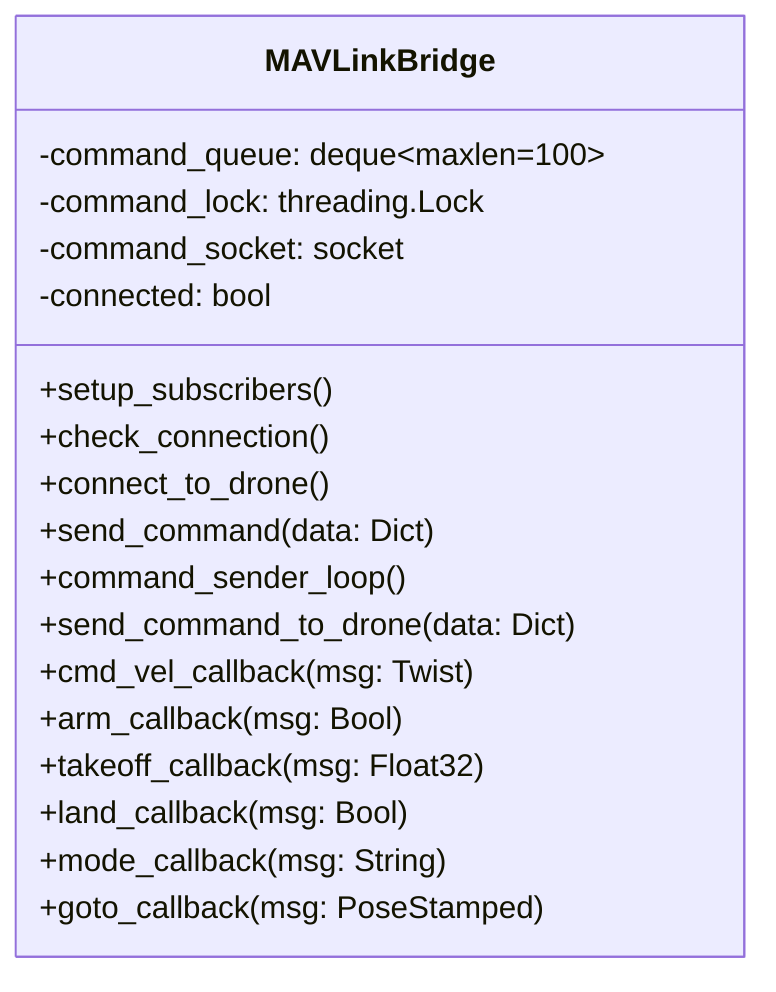

**Thread Model**:
- **Main thread**: ROS2 spin — handles subscription callbacks, enqueues commands
- **Command sender thread** (daemon): Dequeues and sends at 10 Hz
- **Lock**: `command_lock` protects `command_queue`
- **Queue**: `deque(maxlen=100)` — bounded, O(1) popleft, drops oldest on overflow

### 2.3 VideoReceiver (Ground Station)

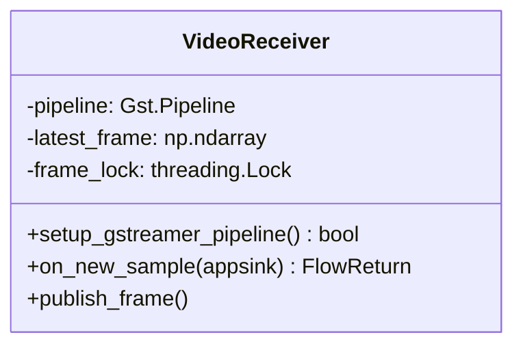

**GStreamer Pipeline**:
```
udpsrc port=5600 caps="application/x-rtp,payload=96"
  → rtph264depay
  → h264parse
  → avdec_h264
  → videoconvert
  → video/x-raw,format=BGR
  → appsink name=sink emit-signals=true sync=false max-buffers=2 drop=true
```

### 2.4 TelemetryBridge (Raspberry Pi)

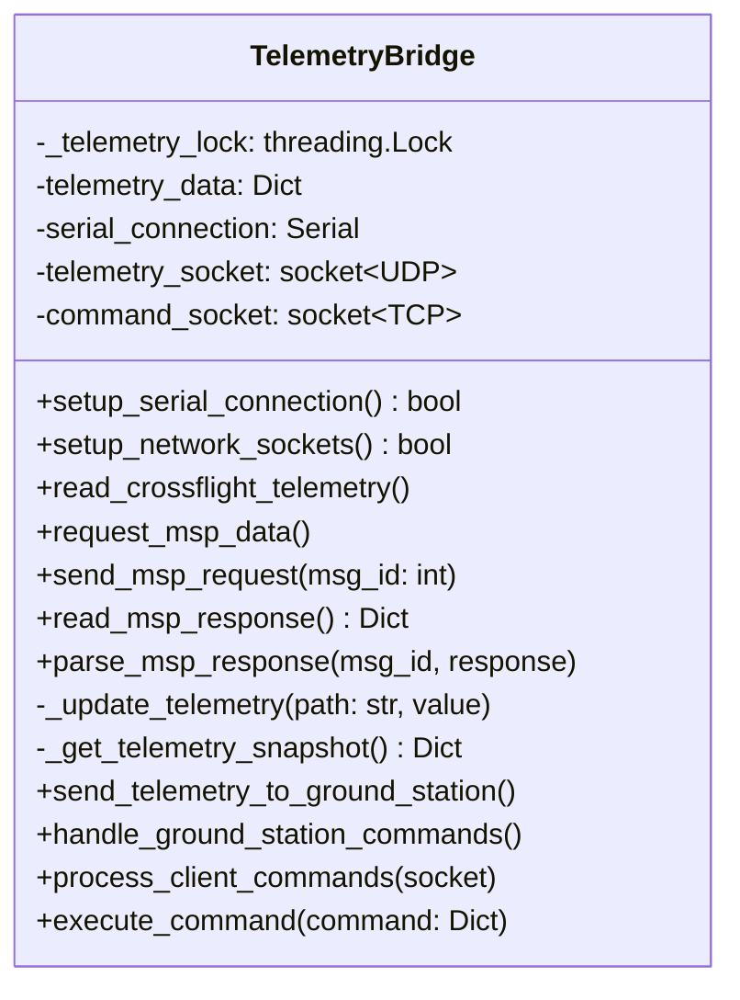

**Thread Model (3 daemon threads)**:
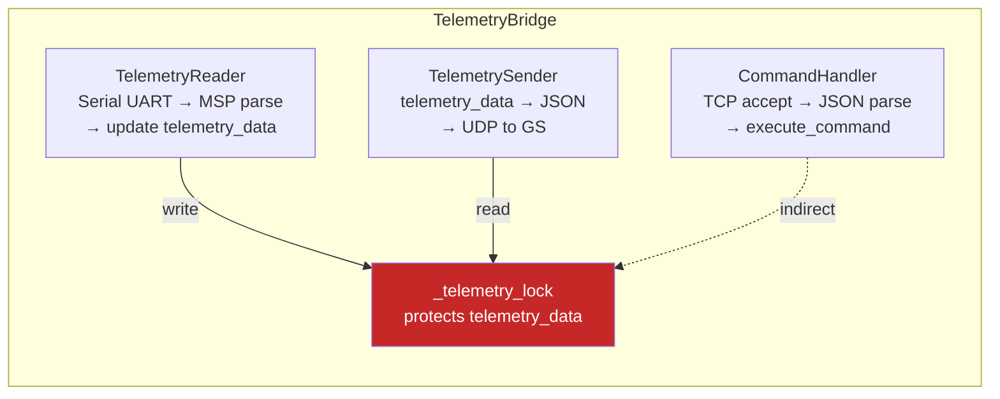

---

## 3. Communication Architecture

### 3.1 Full Data Path — Video

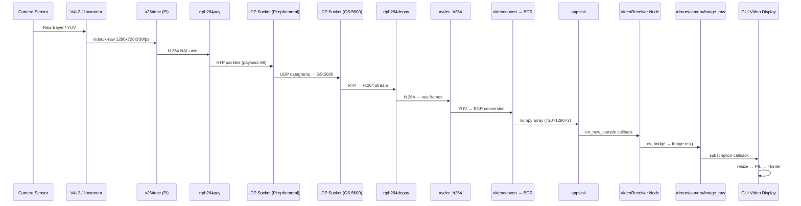

### 3.2 Full Data Path — Telemetry

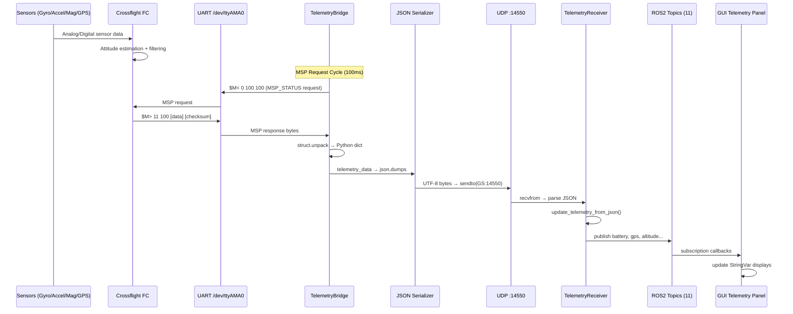

### 3.3 Full Data Path — Commands

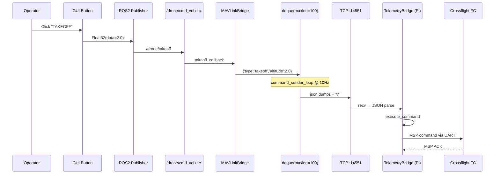

---

## 4. Protocol Details

### 4.1 MSP v1 Packet Format

```
Request:  $  M  <  [data_length]  [msg_id]  [checksum]
          24 4D 3C     00            64         64

Response: $  M  >  [data_length]  [msg_id]  [payload...]  [checksum]
          24 4D 3E     0B            64       [11 bytes]      XX

Checksum = data_length XOR msg_id XOR payload[0] XOR ... XOR payload[N-1]
```

### 4.2 MSP Commands Used

| MSP ID | Name | Response Length | Data Fields |
|--------|------|----------------|-------------|
| 100 | MSP_STATUS | 11 bytes | cycle_time(u16), i2c_errors(u16), sensors(u16), flags(u32), current_set(u8) |
| 102 | MSP_RAW_IMU | 18 bytes | acc_xyz(i16×3), gyro_xyz(i16×3), mag_xyz(i16×3) |
| 106 | MSP_RAW_GPS | 16 bytes | fix(u8), sats(u8), lat(i32), lon(i32), alt(u16), speed(u16), course(u16) |
| 108 | MSP_ATTITUDE | 6 bytes | roll(i16/10°), pitch(i16/10°), yaw(i16°) |
| 110 | MSP_ANALOG | 7 bytes | vbat(u8/10V), power(u16), rssi(u16), amperage(u16/100A) |

### 4.3 JSON Telemetry Schema

```json
{
    "timestamp": 1712678400.0,
    "armed": true,
    "mode": "STABILIZE",
    "battery": {
        "voltage": 12.6,
        "current": 5.0,
        "remaining": 85.0
    },
    "attitude": {
        "roll": 0.1,
        "pitch": -0.2,
        "yaw": 1.5
    },
    "position": {
        "lat": 17.73,
        "lon": 83.30,
        "alt": 25.0
    },
    "velocity": {
        "ground_speed": 3.5,
        "vertical_speed": 0.0
    },
    "gps": {
        "satellites": 12,
        "fix_type": 3,
        "hdop": 1.2
    },
    "sensors": {
        "gyro":  {"x": 0, "y": 0, "z": 0},
        "accel": {"x": 0, "y": 0, "z": 512},
        "mag":   {"x": 100, "y": -50, "z": 300}
    }
}
```

### 4.4 JSON Command Schemas

**Arm/Disarm**:
```json
{"type": "arm", "armed": true, "timestamp": 1712678400.0}
```

**Velocity**:
```json
{"type": "velocity", "linear": {"x": 1.0, "y": 0.0, "z": 0.5}, "angular": {"x": 0.0, "y": 0.0, "z": 0.3}, "timestamp": 1712678400.0}
```

**Takeoff**:
```json
{"type": "takeoff", "altitude": 2.0, "timestamp": 1712678400.0}
```

**Land**:
```json
{"type": "land", "timestamp": 1712678400.0}
```

**Mode Change**:
```json
{"type": "mode", "mode": "LOITER", "timestamp": 1712678400.0}
```

**Goto**:
```json
{"type": "goto", "position": {"x": 17.73, "y": 83.30, "z": 25.0}, "orientation": {"x": 0, "y": 0, "z": 0, "w": 1}, "timestamp": 1712678400.0}
```

---

## 5. Safety Architecture

### 5.1 Failsafe Decision Tree

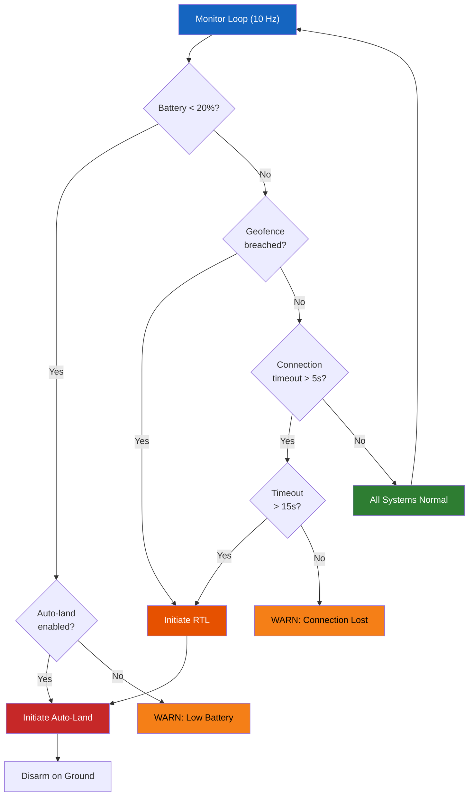

---

## 6. Network Bandwidth Analysis

| Stream | Protocol | Packet Size | Rate | Bandwidth |
|--------|----------|-------------|------|-----------|
| Video | RTP/UDP | ~1400 bytes (MTU) | ~178 pkt/s | **2.0 Mbps** |
| Telemetry | JSON/UDP | ~500 bytes | 10 Hz | **40 Kbps** |
| Commands | JSON/TCP | ~150 bytes | 10 Hz | **12 Kbps** |
| WiFi Overhead | 802.11n | ~40 bytes/pkt | varies | ~200 Kbps |
| **Total** | | | | **~2.3 Mbps** |

WiFi 802.11n theoretical max: 72 Mbps. Operating at **~3% capacity**.

---

## 7. Deployment Architecture

### 7.1 Pi Boot Sequence

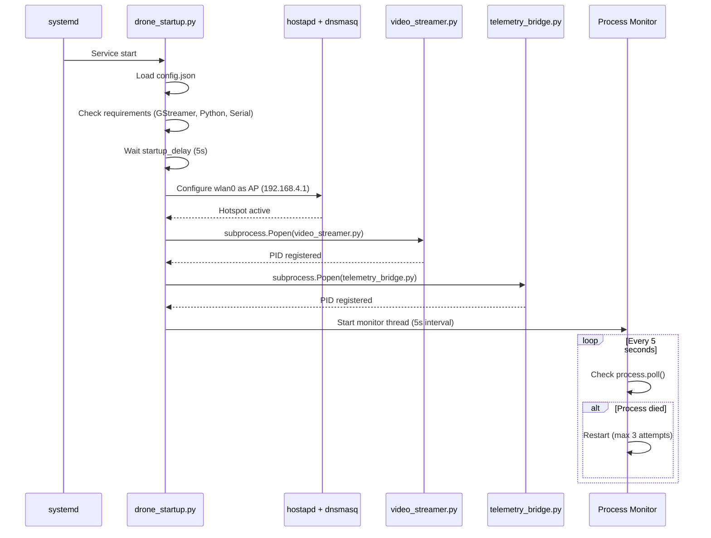

---

*This document is part of the Andhra University CSSE Drone Ground Station project.*