# Visual Diagram Gallery

> A comprehensive collection of system diagrams for the Drone Ground Station project.

---

## 1. Complete System Overview

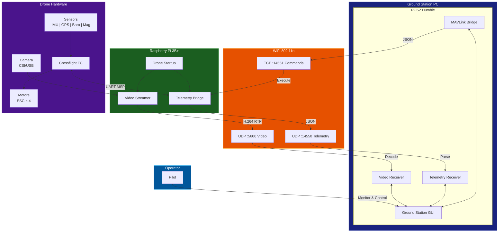
```mermaid
graph TB
    subgraph OPERATOR["Operator"]
        HUMAN["Pilot"]
    end

    subgraph GS["Ground Station PC"]
        direction TB
        subgraph ROS2["ROS2 Humble"]
            VR["Video Receiver"]
            TR["Telemetry Receiver"]
            MB["MAVLink Bridge"]
            GUI["Ground Station GUI"]
        end
    end

    subgraph WIFI["WiFi 802.11n"]
        CH1["UDP :5600 Video"]
        CH2["UDP :14550 Telemetry"]
        CH3["TCP :14551 Commands"]
    end

    subgraph PI["Raspberry Pi 3B+"]
        direction TB
        DS["Drone Startup"]
        VS["Video Streamer"]
        TB2["Telemetry Bridge"]
    end

    subgraph DRONE_HW["Drone Hardware"]
        CAM["Camera<br/>CSI/USB"]
        FC["Crossflight FC"]
        SENS["Sensors<br/>IMU | GPS | Baro | Mag"]
        MOT["Motors<br/>ESC × 4"]
    end

    HUMAN -->|"Monitor & Control"| GUI
    VS -->|"H.264 RTP"| CH1 -->|"Decode"| VR
    TB2 -->|"JSON"| CH2 -->|"Parse"| TR
    MB -->|"JSON"| CH3 -->|"Execute"| TB2
    VR & TR & MB <--> GUI
    DS --> VS & TB2
    CAM --> VS
    FC <-->|"UART MSP"| TB2
    SENS --> FC
    FC --> MOT

    style GS fill:#1a237e,stroke:#5c6bc0,color:#fff
    style PI fill:#1b5e20,stroke:#66bb6a,color:#fff
    style WIFI fill:#e65100,stroke:#ff9800,color:#fff
    style DRONE_HW fill:#4a148c,stroke:#ce93d8,color:#fff
    style OPERATOR fill:#01579b,stroke:#4fc3f7,color:#fff
```

---

## 2. Physical Hardware Architecture

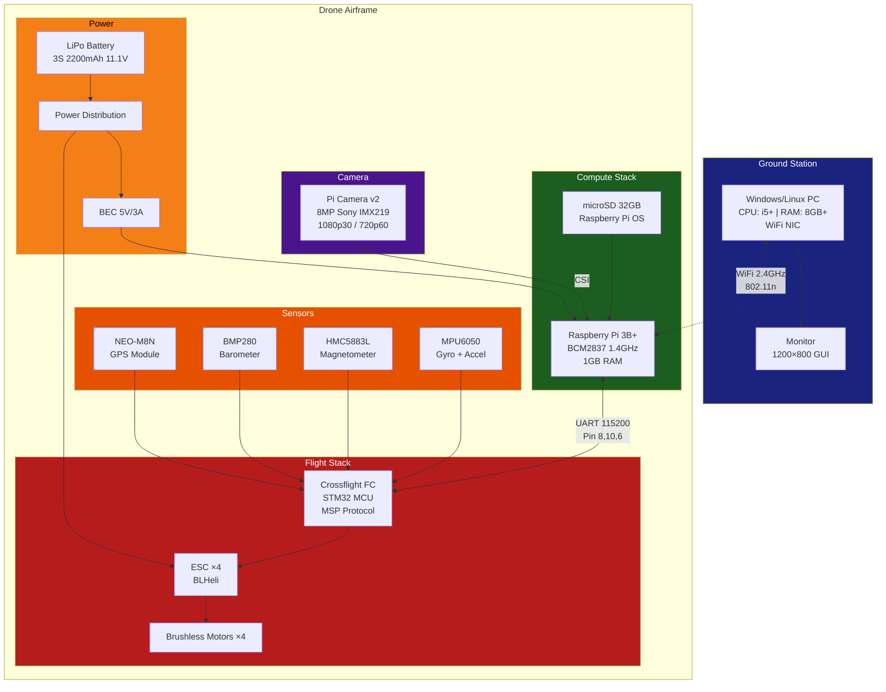
```mermaid
graph TD
    subgraph GROUND["Ground Station"]
        LAPTOP["Windows/Linux PC<br/>CPU: i5+ | RAM: 8GB+<br/>WiFi NIC"]
        DISPLAY["Monitor<br/>1200×800 GUI"]
        LAPTOP --> DISPLAY
    end

    subgraph AIRFRAME["Drone Airframe"]
        subgraph COMPUTE["Compute Stack"]
            RPI["Raspberry Pi 3B+<br/>BCM2837 1.4GHz<br/>1GB RAM"]
            SDCARD["microSD 32GB<br/>Raspberry Pi OS"]
        end

        subgraph FLIGHT["Flight Stack"]
            CROSSFLIGHT["Crossflight FC<br/>STM32 MCU<br/>MSP Protocol"]
            ESC["ESC ×4<br/>BLHeli"]
            MOTOR["Brushless Motors ×4"]
        end

        subgraph SENSORS_GRP["Sensors"]
            IMU2["MPU6050<br/>Gyro + Accel"]
            MAG["HMC5883L<br/>Magnetometer"]
            BARO["BMP280<br/>Barometer"]
            GPS2["NEO-M8N<br/>GPS Module"]
        end

        subgraph CAMERA_GRP["Camera"]
            PICAM["Pi Camera v2<br/>8MP Sony IMX219<br/>1080p30 / 720p60"]
        end

        subgraph POWER["Power"]
            LIPO["LiPo Battery<br/>3S 2200mAh 11.1V"]
            PDB["Power Distribution"]
            BEC["BEC 5V/3A"]
        end
    end

    LAPTOP <-.->|"WiFi 2.4GHz<br/>802.11n"| RPI
    SDCARD --> RPI
    PICAM -->|"CSI"| RPI
    RPI <-->|"UART 115200<br/>Pin 8,10,6"| CROSSFLIGHT
    CROSSFLIGHT --> ESC --> MOTOR
    IMU2 & MAG & BARO & GPS2 --> CROSSFLIGHT
    LIPO --> PDB --> ESC
    PDB --> BEC --> RPI

    style GROUND fill:#1a237e,color:#fff
    style COMPUTE fill:#1b5e20,color:#fff
    style FLIGHT fill:#b71c1c,color:#fff
    style SENSORS_GRP fill:#e65100,color:#fff
    style CAMERA_GRP fill:#4a148c,color:#fff
    style POWER fill:#f57f17,color:#000
```

---

## 3. Network Topology & Ports

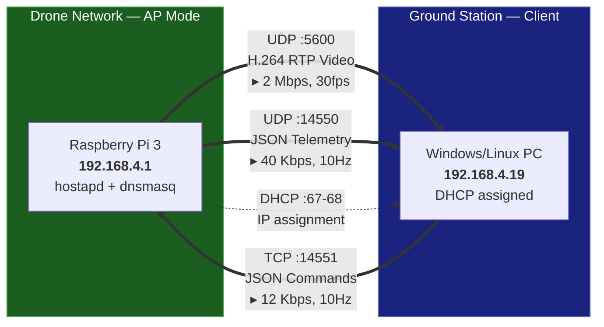
```mermaid
graph LR
    subgraph DRONE_NET["Drone Network — AP Mode"]
        PI2["Raspberry Pi 3<br/><b>192.168.4.1</b><br/>hostapd + dnsmasq"]
    end

    subgraph GS_NET["Ground Station — Client"]
        PC2["Windows/Linux PC<br/><b>192.168.4.19</b><br/>DHCP assigned"]
    end

    PI2 == "UDP :5600<br/>H.264 RTP Video<br/>▸ 2 Mbps, 30fps" ==> PC2
    PI2 == "UDP :14550<br/>JSON Telemetry<br/>▸ 40 Kbps, 10Hz" ==> PC2
    PC2 == "TCP :14551<br/>JSON Commands<br/>▸ 12 Kbps, 10Hz" ==> PI2
    PI2 -. "DHCP :67-68<br/>IP assignment" .-> PC2

    style DRONE_NET fill:#1b5e20,stroke:#4caf50,color:#fff
    style GS_NET fill:#1a237e,stroke:#5c6bc0,color:#fff
```

---

## 4. ROS2 Node Graph (Full)

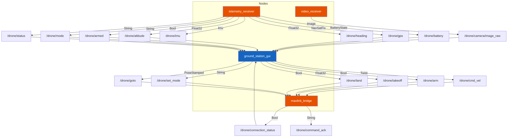
```mermaid
graph TD
    subgraph Nodes
        VR["video_receiver"]
        TR["telemetry_receiver"]
        MB["mavlink_bridge"]
        GUI["ground_station_gui"]
    end

    VR -->|"Image"| T_IMG["/drone/camera/image_raw"]
    TR -->|"BatteryState"| T_BAT["/drone/battery"]
    TR -->|"NavSatFix"| T_GPS["/drone/gps"]
    TR -->|"Imu"| T_IMU["/drone/imu"]
    TR -->|"Float32"| T_ALT["/drone/altitude"]
    TR -->|"Float32"| T_HDG["/drone/heading"]
    TR -->|"Bool"| T_ARM["/drone/armed"]
    TR -->|"String"| T_MOD["/drone/mode"]
    TR -->|"String"| T_STS["/drone/status"]
    MB -->|"Bool"| T_CON["/drone/connection_status"]
    MB -->|"String"| T_ACK["/drone/command_ack"]

    T_IMG --> GUI
    T_BAT --> GUI
    T_GPS --> GUI
    T_ALT --> GUI
    T_ARM --> GUI
    T_MOD --> GUI
    T_CON --> GUI
    T_STS --> GUI

    GUI -->|"Twist"| C_VEL["/drone/cmd_vel"] --> MB
    GUI -->|"Bool"| C_ARM["/drone/arm"] --> MB
    GUI -->|"Float32"| C_TKO["/drone/takeoff"] --> MB
    GUI -->|"Bool"| C_LND["/drone/land"] --> MB
    GUI -->|"String"| C_MOD["/drone/set_mode"] --> MB
    GUI -->|"PoseStamped"| C_GTO["/drone/goto"] --> MB

    style VR fill:#e65100,color:#fff
    style TR fill:#e65100,color:#fff
    style MB fill:#e65100,color:#fff
    style GUI fill:#1565c0,color:#fff
```

---

## 5. Video Streaming Pipeline

```mermaid
graph LR
    subgraph PI_SIDE["Raspberry Pi (Sender)"]
        CAM2["Camera<br/>IMX219"] --> V4L["v4l2src /<br/>libcamerasrc"]
        V4L --> RAW["video/x-raw<br/>1280×720@30fps"]
        RAW --> CONV1["videoconvert"]
        CONV1 --> ENC["x264enc<br/>bitrate=2000<br/>ultrafast<br/>zerolatency"]
        ENC --> PAY["rtph264pay<br/>config-interval=1<br/>pt=96"]
        PAY --> SINK["udpsink<br/>host=192.168.4.19<br/>port=5600"]
    end

    subgraph NETWORK["WiFi"]
        PKT["RTP/UDP<br/>Packets"]
    end

    subgraph GS_SIDE["Ground Station (Receiver)"]
        SRC["udpsrc<br/>port=5600"]
        SRC --> DEPAY["rtph264depay"]
        DEPAY --> PARSE["h264parse"]
        PARSE --> DEC["avdec_h264"]
        DEC --> CONV2["videoconvert<br/>→ BGR"]
        CONV2 --> APP["appsink<br/>max-buffers=2<br/>drop=true"]
        APP --> NP["numpy array<br/>720×1280×3"]
        NP --> ROS["cv_bridge<br/>→ Image msg"]
        ROS --> PUB["/drone/camera/<br/>image_raw"]
    end

    SINK --> PKT --> SRC

    style PI_SIDE fill:#1b5e20,color:#fff
    style GS_SIDE fill:#1a237e,color:#fff
    style NETWORK fill:#e65100,color:#fff
```

---

## 6. Telemetry Data Pipeline

```mermaid
graph LR
    subgraph FC_SIDE["Crossflight FC"]
        SENS2["Sensors"] --> PROC["Attitude +<br/>GPS Processing"]
        PROC --> MSP_SRV["MSP Server"]
    end

    subgraph PI_SIDE2["Raspberry Pi"]
        MSP_REQ["MSP Request<br/>$M< 0 cmd chk"] --> UART2["UART TX"]
        UART_RX["UART RX"] --> MSP_RESP["MSP Response<br/>$M> len cmd data chk"]
        MSP_RESP --> UNPACK["struct.unpack<br/>Binary → Python"]
        UNPACK --> DICT["telemetry_data<br/>Dict (locked)"]
        DICT --> SERIAL["json.dumps"]
        SERIAL --> UDP_SEND["UDP sendto<br/>GS:14550"]
    end

    subgraph GS_SIDE2["Ground Station"]
        UDP_RECV["UDP recvfrom<br/>:14550"]
        UDP_RECV --> JSON_P["json.loads /<br/>MAVLink parse"]
        JSON_P --> TELEM["telemetry_data<br/>Dict (locked)"]
        TELEM --> PUB2["ROS2 Publish<br/>11 topics"]
        PUB2 --> GUI2["GUI Update<br/>10 Hz"]
    end

    MSP_SRV <-->|"UART 115200"| UART2
    MSP_SRV <-->|"UART 115200"| UART_RX
    UDP_SEND -->|"WiFi"| UDP_RECV

    style FC_SIDE fill:#4a148c,color:#fff
    style PI_SIDE2 fill:#1b5e20,color:#fff
    style GS_SIDE2 fill:#1a237e,color:#fff
```

---

## 7. Command Pipeline

```mermaid
graph RL
    subgraph GUI_SIDE["Ground Station GUI"]
        BTN["Button Click<br/>ARM / TAKEOFF / LAND"]
        BTN --> PUB3["ROS2 Publish"]
    end

    subgraph BRIDGE_SIDE["MAVLink Bridge"]
        SUB["Subscription<br/>Callback"]
        SUB --> Q["Command Queue<br/>deque(maxlen=100)"]
        Q --> SENDER["Sender Loop<br/>10 Hz"]
        SENDER --> TCP_SEND["TCP send<br/>JSON + \\n"]
    end

    subgraph PI_SIDE3["Raspberry Pi"]
        TCP_RECV["TCP recv"]
        TCP_RECV --> JSON_CMD["json.loads"]
        JSON_CMD --> EXEC["execute_command"]
        EXEC --> MSP_CMD["MSP Command<br/>UART TX"]
    end

    subgraph FC_SIDE2["Crossflight FC"]
        FC_EXEC["Execute<br/>ARM / Motor / Mode"]
    end

    PUB3 -->|"ROS2 Topic"| SUB
    TCP_SEND -->|"WiFi TCP :14551"| TCP_RECV
    MSP_CMD -->|"UART"| FC_EXEC

    style GUI_SIDE fill:#1565c0,color:#fff
    style BRIDGE_SIDE fill:#283593,color:#fff
    style PI_SIDE3 fill:#1b5e20,color:#fff
    style FC_SIDE2 fill:#4a148c,color:#fff
```

---

## 8. Normal Flight Sequence

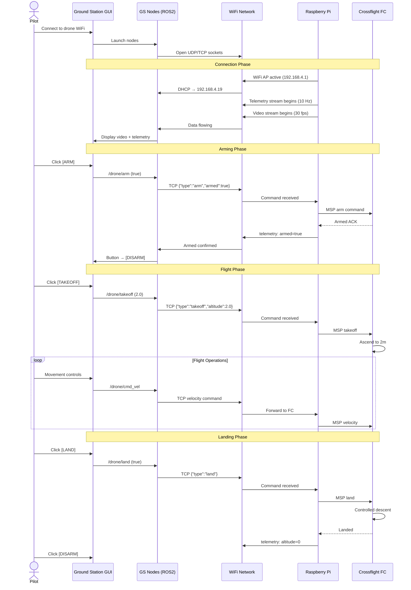
```mermaid
sequenceDiagram
    actor Pilot
    participant GUI as Ground Station GUI
    participant GS as GS Nodes (ROS2)
    participant NET as WiFi Network
    participant PI as Raspberry Pi
    participant FC as Crossflight FC

    Pilot->>GUI: Connect to drone WiFi
    GUI->>GS: Launch nodes
    GS->>NET: Open UDP/TCP sockets

    Note over GUI,FC: Connection Phase
    PI->>NET: WiFi AP active (192.168.4.1)
    NET->>GS: DHCP → 192.168.4.19
    PI->>NET: Telemetry stream begins (10 Hz)
    PI->>NET: Video stream begins (30 fps)
    NET->>GS: Data flowing
    GS->>GUI: Display video + telemetry

    Note over GUI,FC: Arming Phase
    Pilot->>GUI: Click [ARM]
    GUI->>GS: /drone/arm (true)
    GS->>NET: TCP {"type":"arm","armed":true}
    NET->>PI: Command received
    PI->>FC: MSP arm command
    FC-->>PI: Armed ACK
    PI->>NET: telemetry: armed=true
    NET->>GS: Armed confirmed
    GS->>GUI: Button → [DISARM]

    Note over GUI,FC: Flight Phase
    Pilot->>GUI: Click [TAKEOFF]
    GUI->>GS: /drone/takeoff (2.0)
    GS->>NET: TCP {"type":"takeoff","altitude":2.0}
    NET->>PI: Command received
    PI->>FC: MSP takeoff
    FC->>FC: Ascend to 2m

    loop Flight Operations
        Pilot->>GUI: Movement controls
        GUI->>GS: /drone/cmd_vel
        GS->>NET: TCP velocity command
        NET->>PI: Forward to FC
        PI->>FC: MSP velocity
    end

    Note over GUI,FC: Landing Phase
    Pilot->>GUI: Click [LAND]
    GUI->>GS: /drone/land (true)
    GS->>NET: TCP {"type":"land"}
    NET->>PI: Command received
    PI->>FC: MSP land
    FC->>FC: Controlled descent
    FC-->>PI: Landed
    PI->>NET: telemetry: altitude=0
    Pilot->>GUI: Click [DISARM]
```

---

## 9. Emergency Stop Sequence

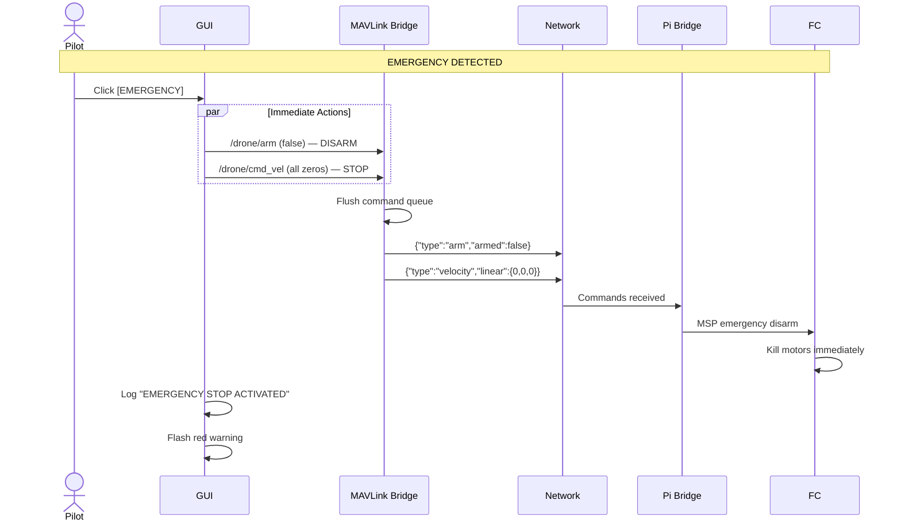
```mermaid
sequenceDiagram
    actor Pilot
    participant GUI as GUI
    participant MB as MAVLink Bridge
    participant NET as Network
    participant PI as Pi Bridge
    participant FC as FC

    Note over Pilot,FC: EMERGENCY DETECTED
    Pilot->>GUI: Click [EMERGENCY]

    par Immediate Actions
        GUI->>MB: /drone/arm (false) — DISARM
        GUI->>MB: /drone/cmd_vel (all zeros) — STOP
    end

    MB->>MB: Flush command queue
    MB->>NET: {"type":"arm","armed":false}
    MB->>NET: {"type":"velocity","linear":{0,0,0}}
    NET->>PI: Commands received
    PI->>FC: MSP emergency disarm
    FC->>FC: Kill motors immediately

    GUI->>GUI: Log "EMERGENCY STOP ACTIVATED"
    GUI->>GUI: Flash red warning
```

---

## 10. Connection Loss & Recovery

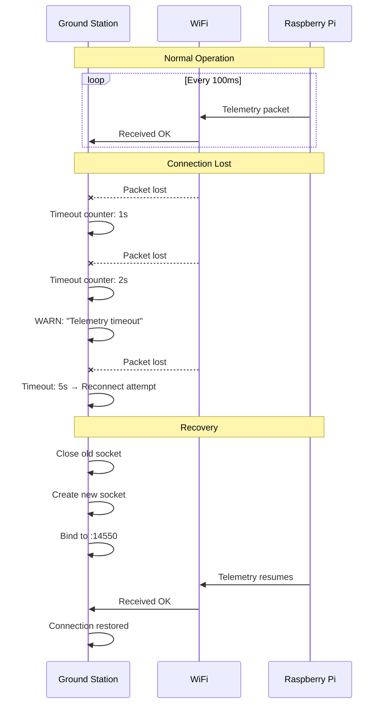
```mermaid
sequenceDiagram
    participant GS as Ground Station
    participant NET as WiFi
    participant PI as Raspberry Pi

    Note over GS,PI: Normal Operation
    loop Every 100ms
        PI->>NET: Telemetry packet
        NET->>GS: Received OK
    end

    Note over GS,PI: Connection Lost
    NET--xGS: Packet lost
    GS->>GS: Timeout counter: 1s
    NET--xGS: Packet lost
    GS->>GS: Timeout counter: 2s
    GS->>GS: WARN: "Telemetry timeout"
    NET--xGS: Packet lost
    GS->>GS: Timeout: 5s → Reconnect attempt

    Note over GS,PI: Recovery
    GS->>GS: Close old socket
    GS->>GS: Create new socket
    GS->>GS: Bind to :14550
    PI->>NET: Telemetry resumes
    NET->>GS: Received OK
    GS->>GS: Connection restored
```

---

## 11. Flight State Machine

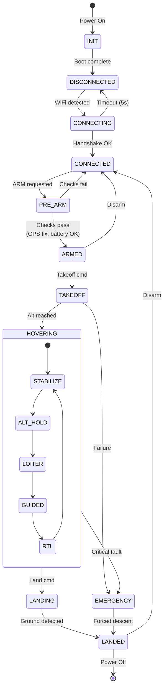
```mermaid
stateDiagram-v2
    [*] --> INIT: Power On

    INIT --> DISCONNECTED: Boot complete

    DISCONNECTED --> CONNECTING: WiFi detected
    CONNECTING --> CONNECTED: Handshake OK
    CONNECTING --> DISCONNECTED: Timeout (5s)

    CONNECTED --> PRE_ARM: ARM requested
    PRE_ARM --> ARMED: Checks pass<br/>(GPS fix, battery OK)
    PRE_ARM --> CONNECTED: Checks fail

    ARMED --> TAKEOFF: Takeoff cmd
    ARMED --> CONNECTED: Disarm

    TAKEOFF --> HOVERING: Alt reached
    TAKEOFF --> EMERGENCY: Failure

    state HOVERING {
        [*] --> STABILIZE
        STABILIZE --> ALT_HOLD
        ALT_HOLD --> LOITER
        LOITER --> GUIDED
        GUIDED --> RTL
        RTL --> STABILIZE
    }

    HOVERING --> LANDING: Land cmd
    HOVERING --> EMERGENCY: Critical fault

    LANDING --> LANDED: Ground detected
    EMERGENCY --> LANDED: Forced descent

    LANDED --> CONNECTED: Disarm
    LANDED --> [*]: Power Off
```

---

## 12. Connection State Machine

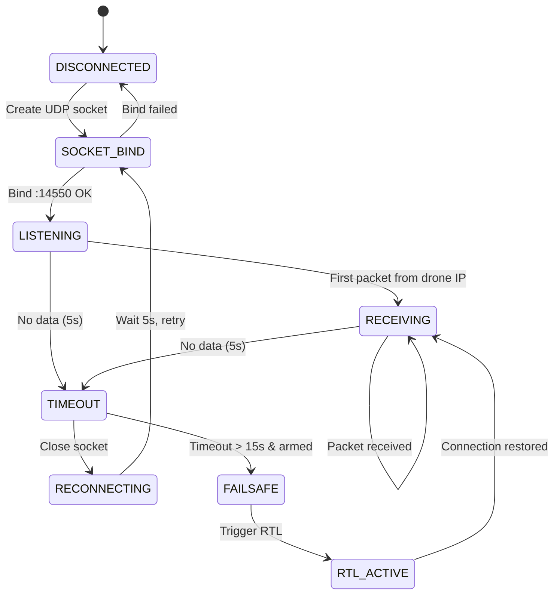
```mermaid
stateDiagram-v2
    [*] --> DISCONNECTED

    DISCONNECTED --> SOCKET_BIND: Create UDP socket
    SOCKET_BIND --> LISTENING: Bind :14550 OK
    SOCKET_BIND --> DISCONNECTED: Bind failed

    LISTENING --> RECEIVING: First packet from drone IP
    LISTENING --> TIMEOUT: No data (5s)

    RECEIVING --> RECEIVING: Packet received
    RECEIVING --> TIMEOUT: No data (5s)

    TIMEOUT --> RECONNECTING: Close socket
    RECONNECTING --> SOCKET_BIND: Wait 5s, retry

    TIMEOUT --> FAILSAFE: Timeout > 15s & armed

    FAILSAFE --> RTL_ACTIVE: Trigger RTL
    RTL_ACTIVE --> RECEIVING: Connection restored
```

---

## 13. Ground Station Class Diagram

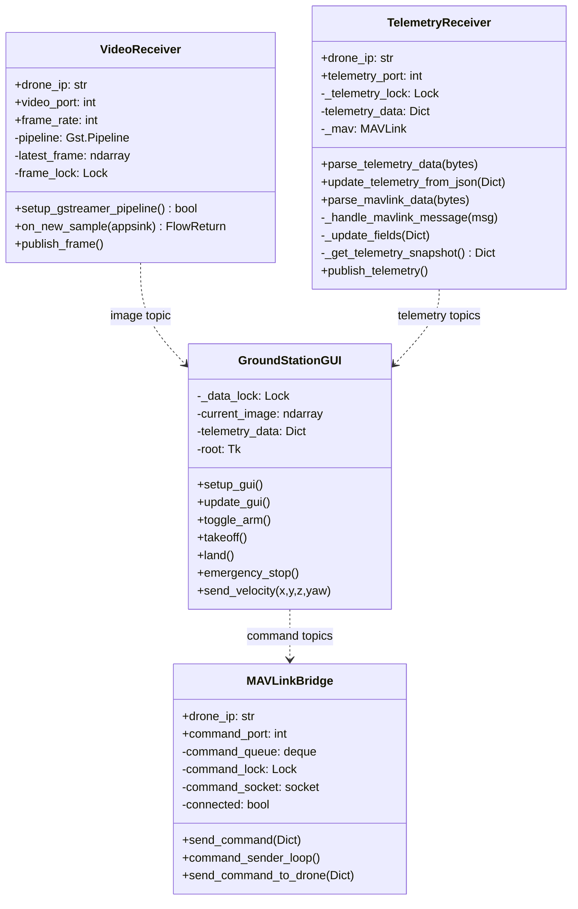
```mermaid
classDiagram
    class VideoReceiver {
        +drone_ip: str
        +video_port: int
        +frame_rate: int
        -pipeline: Gst.Pipeline
        -latest_frame: ndarray
        -frame_lock: Lock
        +setup_gstreamer_pipeline() bool
        +on_new_sample(appsink) FlowReturn
        +publish_frame()
    }

    class TelemetryReceiver {
        +drone_ip: str
        +telemetry_port: int
        -_telemetry_lock: Lock
        -telemetry_data: Dict
        -_mav: MAVLink
        +parse_telemetry_data(bytes)
        +update_telemetry_from_json(Dict)
        +parse_mavlink_data(bytes)
        -_handle_mavlink_message(msg)
        -_update_fields(Dict)
        -_get_telemetry_snapshot() Dict
        +publish_telemetry()
    }

    class MAVLinkBridge {
        +drone_ip: str
        +command_port: int
        -command_queue: deque
        -command_lock: Lock
        -command_socket: socket
        -connected: bool
        +send_command(Dict)
        +command_sender_loop()
        +send_command_to_drone(Dict)
    }

    class GroundStationGUI {
        -_data_lock: Lock
        -current_image: ndarray
        -telemetry_data: Dict
        -root: Tk
        +setup_gui()
        +update_gui()
        +toggle_arm()
        +takeoff()
        +land()
        +emergency_stop()
        +send_velocity(x,y,z,yaw)
    }

    VideoReceiver ..> GroundStationGUI : image topic
    TelemetryReceiver ..> GroundStationGUI : telemetry topics
    GroundStationGUI ..> MAVLinkBridge : command topics
```

---

## 14. Raspberry Pi Class Diagram

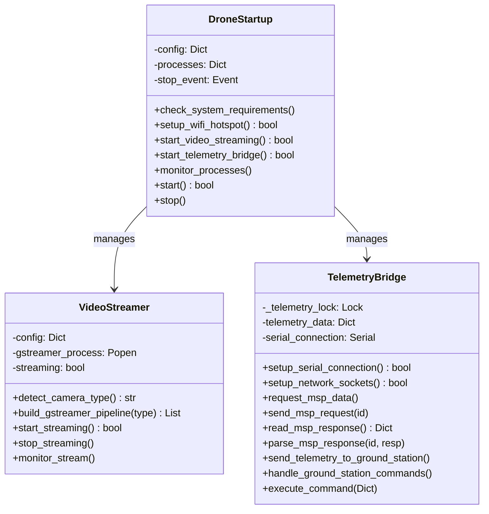
```mermaid
classDiagram
    class DroneStartup {
        -config: Dict
        -processes: Dict
        -stop_event: Event
        +check_system_requirements()
        +setup_wifi_hotspot() bool
        +start_video_streaming() bool
        +start_telemetry_bridge() bool
        +monitor_processes()
        +start() bool
        +stop()
    }

    class VideoStreamer {
        -config: Dict
        -gstreamer_process: Popen
        -streaming: bool
        +detect_camera_type() str
        +build_gstreamer_pipeline(type) List
        +start_streaming() bool
        +stop_streaming()
        +monitor_stream()
    }

    class TelemetryBridge {
        -_telemetry_lock: Lock
        -telemetry_data: Dict
        -serial_connection: Serial
        +setup_serial_connection() bool
        +setup_network_sockets() bool
        +request_msp_data()
        +send_msp_request(id)
        +read_msp_response() Dict
        +parse_msp_response(id, resp)
        +send_telemetry_to_ground_station()
        +handle_ground_station_commands()
        +execute_command(Dict)
    }

    DroneStartup --> VideoStreamer : manages
    DroneStartup --> TelemetryBridge : manages
```

---

## 15. Safety Decision Flowchart

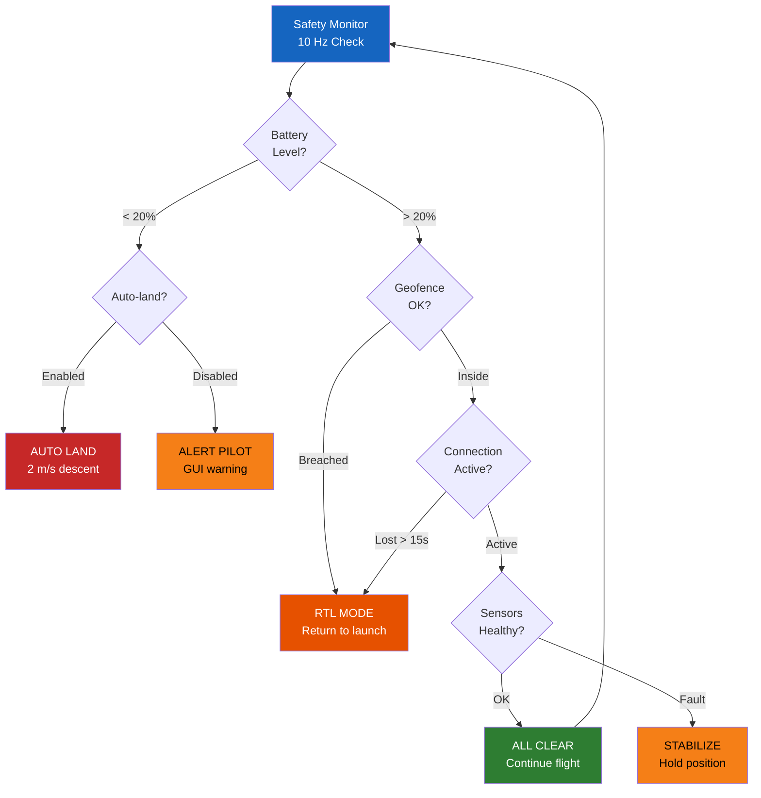
```mermaid
flowchart TD
    A["Safety Monitor<br/>10 Hz Check"] --> B{Battery<br/>Level?}

    B -->|"> 20%"| C{Geofence<br/>OK?}
    B -->|"< 20%"| D{Auto-land?}

    D -->|"Enabled"| E["AUTO LAND<br/>2 m/s descent"]
    D -->|"Disabled"| F["ALERT PILOT<br/>GUI warning"]

    C -->|"Inside"| G{Connection<br/>Active?}
    C -->|"Breached"| H["RTL MODE<br/>Return to launch"]

    G -->|"Active"| I{Sensors<br/>Healthy?}
    G -->|"Lost > 15s"| H

    I -->|"OK"| J["ALL CLEAR<br/>Continue flight"]
    I -->|"Fault"| K["STABILIZE<br/>Hold position"]

    J --> A

    style A fill:#1565c0,color:#fff
    style E fill:#c62828,color:#fff
    style H fill:#e65100,color:#fff
    style J fill:#2e7d32,color:#fff
    style K fill:#f57f17,color:#000
    style F fill:#f57f17,color:#000
```

---

## 16. Thread Model — All Processes

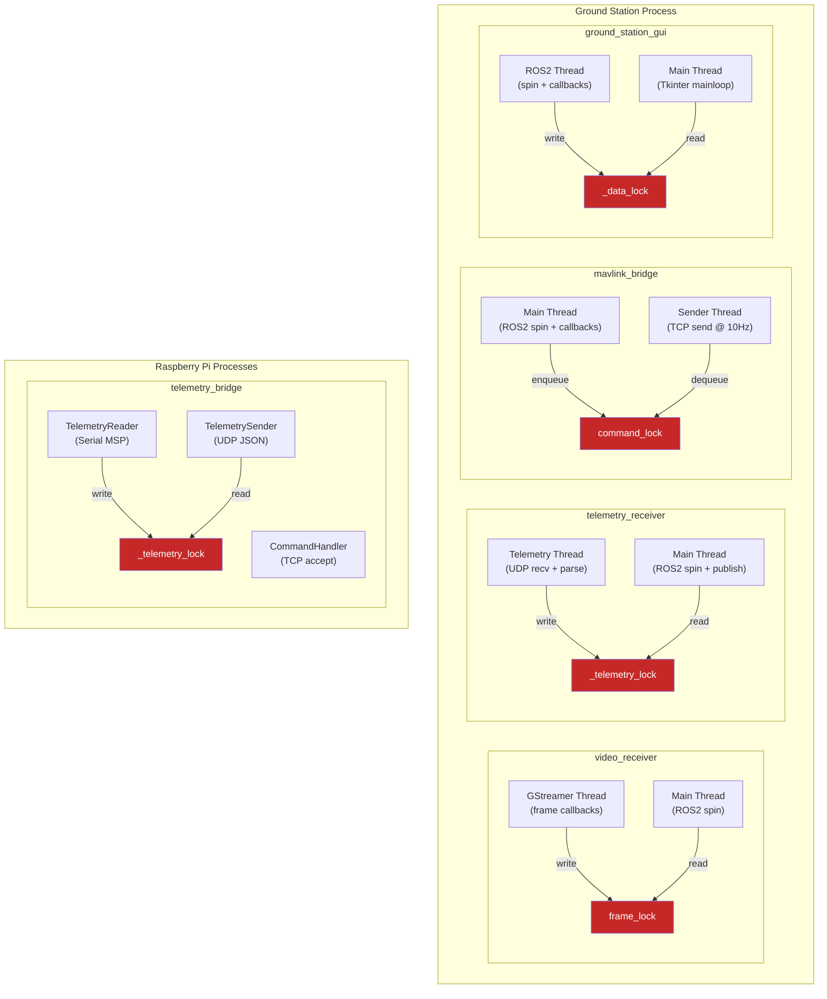
```mermaid
graph TB
    subgraph GS_PROC["Ground Station Process"]
        subgraph VR_NODE["video_receiver"]
            VR_MAIN["Main Thread<br/>(ROS2 spin)"]
            VR_GST["GStreamer Thread<br/>(frame callbacks)"]
            VR_LOCK["frame_lock"]
            VR_GST -->|"write"| VR_LOCK
            VR_MAIN -->|"read"| VR_LOCK
        end

        subgraph TR_NODE["telemetry_receiver"]
            TR_MAIN["Main Thread<br/>(ROS2 spin + publish)"]
            TR_UDP["Telemetry Thread<br/>(UDP recv + parse)"]
            TR_LOCK["_telemetry_lock"]
            TR_UDP -->|"write"| TR_LOCK
            TR_MAIN -->|"read"| TR_LOCK
        end

        subgraph MB_NODE["mavlink_bridge"]
            MB_MAIN["Main Thread<br/>(ROS2 spin + callbacks)"]
            MB_SEND["Sender Thread<br/>(TCP send @ 10Hz)"]
            MB_LOCK["command_lock"]
            MB_MAIN -->|"enqueue"| MB_LOCK
            MB_SEND -->|"dequeue"| MB_LOCK
        end

        subgraph GUI_NODE["ground_station_gui"]
            GUI_ROS["ROS2 Thread<br/>(spin + callbacks)"]
            GUI_TK["Main Thread<br/>(Tkinter mainloop)"]
            GUI_LOCK["_data_lock"]
            GUI_ROS -->|"write"| GUI_LOCK
            GUI_TK -->|"read"| GUI_LOCK
        end
    end

    subgraph PI_PROC["Raspberry Pi Processes"]
        subgraph TB_PROC["telemetry_bridge"]
            TB_READ["TelemetryReader<br/>(Serial MSP)"]
            TB_SEND2["TelemetrySender<br/>(UDP JSON)"]
            TB_CMD["CommandHandler<br/>(TCP accept)"]
            TB_LOCK2["_telemetry_lock"]
            TB_READ -->|"write"| TB_LOCK2
            TB_SEND2 -->|"read"| TB_LOCK2
        end
    end

    style VR_LOCK fill:#c62828,color:#fff
    style TR_LOCK fill:#c62828,color:#fff
    style MB_LOCK fill:#c62828,color:#fff
    style GUI_LOCK fill:#c62828,color:#fff
    style TB_LOCK2 fill:#c62828,color:#fff
```

---

## 17. Pi Boot Sequence

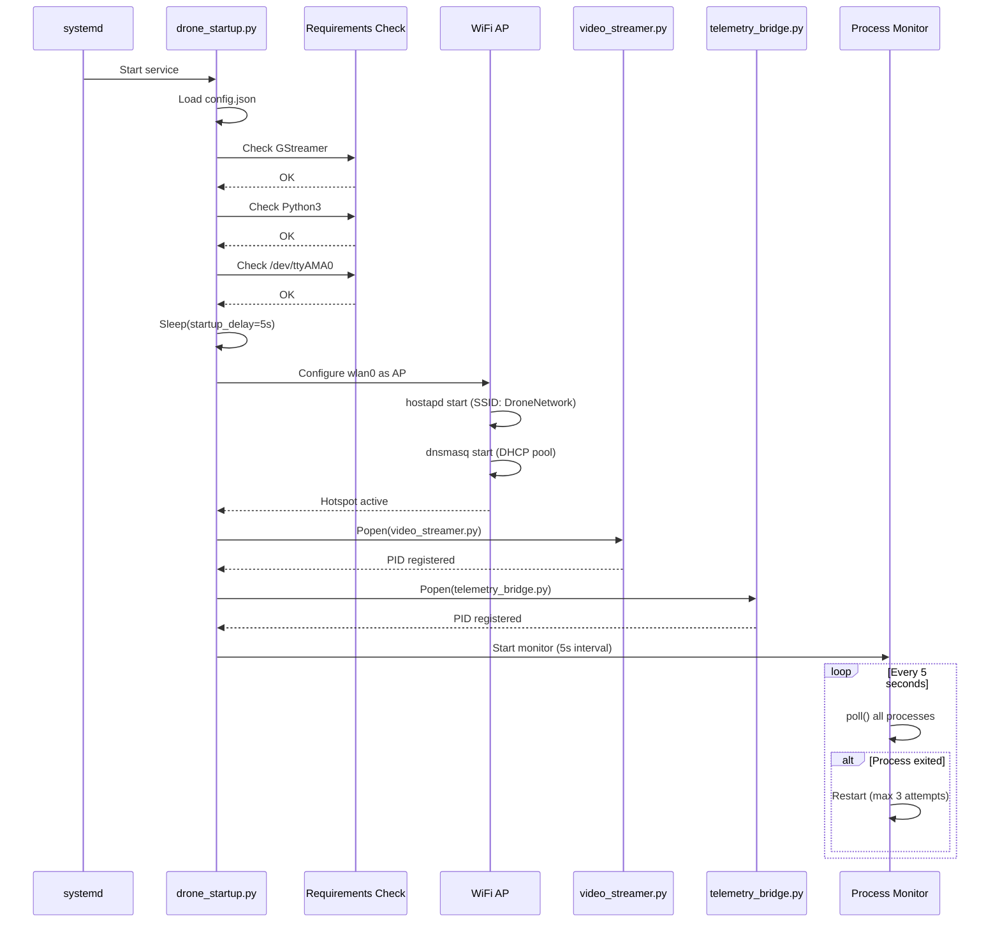
```mermaid
sequenceDiagram
    participant SYS as systemd
    participant DS as drone_startup.py
    participant REQ as Requirements Check
    participant AP as WiFi AP
    participant VS2 as video_streamer.py
    participant TB3 as telemetry_bridge.py
    participant MON as Process Monitor

    SYS->>DS: Start service
    DS->>DS: Load config.json

    DS->>REQ: Check GStreamer
    REQ-->>DS: OK
    DS->>REQ: Check Python3
    REQ-->>DS: OK
    DS->>REQ: Check /dev/ttyAMA0
    REQ-->>DS: OK

    DS->>DS: Sleep(startup_delay=5s)

    DS->>AP: Configure wlan0 as AP
    AP->>AP: hostapd start (SSID: DroneNetwork)
    AP->>AP: dnsmasq start (DHCP pool)
    AP-->>DS: Hotspot active

    DS->>VS2: Popen(video_streamer.py)
    VS2-->>DS: PID registered
    DS->>TB3: Popen(telemetry_bridge.py)
    TB3-->>DS: PID registered

    DS->>MON: Start monitor (5s interval)
    loop Every 5 seconds
        MON->>MON: poll() all processes
        alt Process exited
            MON->>MON: Restart (max 3 attempts)
        end
    end
```

---

## 18. Data Transform Pipeline

```mermaid
graph LR
    A["Raw Sensor<br/>Analog/Digital"] --> B["FC Processing<br/>Kalman Filter"]
    B --> C["MSP Binary<br/>$M> len cmd data chk"]
    C --> D["struct.unpack<br/>Binary → int/float"]
    D --> E["Python Dict<br/>telemetry_data{}"]
    E --> F["json.dumps<br/>Dict → String"]
    F --> G["UTF-8 encode<br/>String → bytes"]
    G --> H["UDP sendto<br/>Network packet"]
    H --> I["UDP recvfrom<br/>bytes received"]
    I --> J["json.loads<br/>bytes → Dict"]
    J --> K["ROS2 Message<br/>BatteryState etc."]
    K --> L["Tkinter Widget<br/>StringVar.set()"]

    style A fill:#4a148c,color:#fff
    style C fill:#1b5e20,color:#fff
    style F fill:#e65100,color:#fff
    style H fill:#b71c1c,color:#fff
    style K fill:#1a237e,color:#fff
    style L fill:#01579b,color:#fff
```

---

## 19. MSP Packet Structure

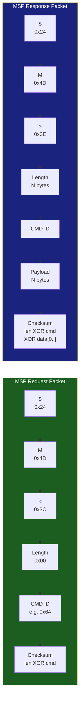
```mermaid
graph LR
    subgraph REQUEST["MSP Request Packet"]
        R1["$<br/>0x24"] --> R2["M<br/>0x4D"] --> R3["<<br/>0x3C"]
        R3 --> R4["Length<br/>0x00"]
        R4 --> R5["CMD ID<br/>e.g. 0x64"]
        R5 --> R6["Checksum<br/>len XOR cmd"]
    end

    subgraph RESPONSE["MSP Response Packet"]
        S1["$<br/>0x24"] --> S2["M<br/>0x4D"] --> S3["><br/>0x3E"]
        S3 --> S4["Length<br/>N bytes"]
        S4 --> S5["CMD ID"]
        S5 --> S6["Payload<br/>N bytes"]
        S6 --> S7["Checksum<br/>len XOR cmd<br/>XOR data[0..]"]
    end

    style REQUEST fill:#1b5e20,color:#fff
    style RESPONSE fill:#1a237e,color:#fff
```

---

## 20. GUI Layout Structure

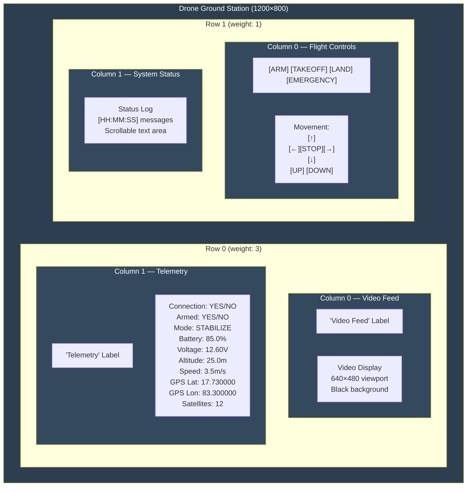
```mermaid
graph TB
    subgraph ROOT["Drone Ground Station (1200×800)"]
        subgraph ROW0["Row 0 (weight: 3)"]
            subgraph COL0_R0["Column 0 — Video Feed"]
                VID_TITLE["'Video Feed' Label"]
                VID_DISP["Video Display<br/>640×480 viewport<br/>Black background"]
            end
            subgraph COL1_R0["Column 1 — Telemetry"]
                TEL_TITLE["'Telemetry' Label"]
                TEL_DATA["Connection: YES/NO<br/>Armed: YES/NO<br/>Mode: STABILIZE<br/>Battery: 85.0%<br/>Voltage: 12.60V<br/>Altitude: 25.0m<br/>Speed: 3.5m/s<br/>GPS Lat: 17.730000<br/>GPS Lon: 83.300000<br/>Satellites: 12"]
            end
        end

        subgraph ROW1["Row 1 (weight: 1)"]
            subgraph COL0_R1["Column 0 — Flight Controls"]
                BTN_ROW["[ARM] [TAKEOFF] [LAND] [EMERGENCY]"]
                MOVE["Movement:<br/>[↑]<br/>[←][STOP][→]<br/>[↓]<br/>[UP] [DOWN]"]
            end
            subgraph COL1_R1["Column 1 — System Status"]
                STATUS["Status Log<br/>[HH:MM:SS] messages<br/>Scrollable text area"]
            end
        end
    end

    style ROOT fill:#2c3e50,color:#fff
    style COL0_R0 fill:#34495e,color:#fff
    style COL1_R0 fill:#34495e,color:#fff
    style COL0_R1 fill:#34495e,color:#fff
    style COL1_R1 fill:#34495e,color:#fff
```

---

*Visual Diagram Gallery — Andhra University CSSE Drone Ground Station*