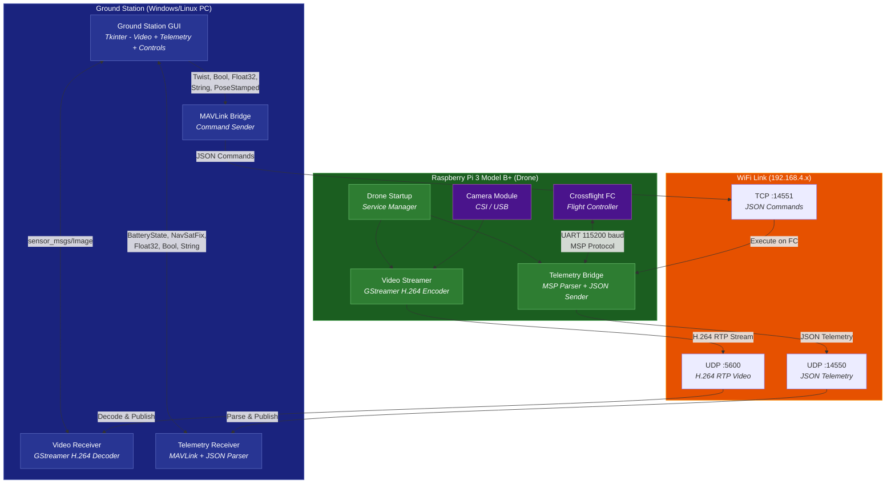
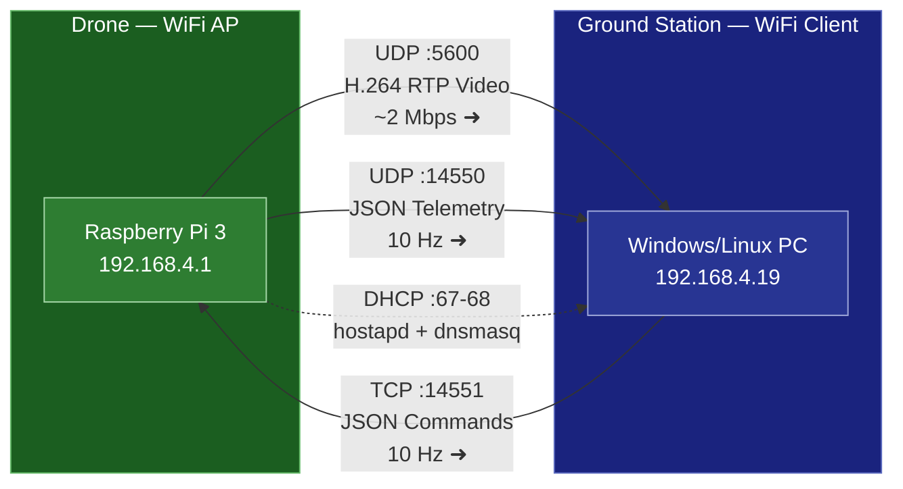
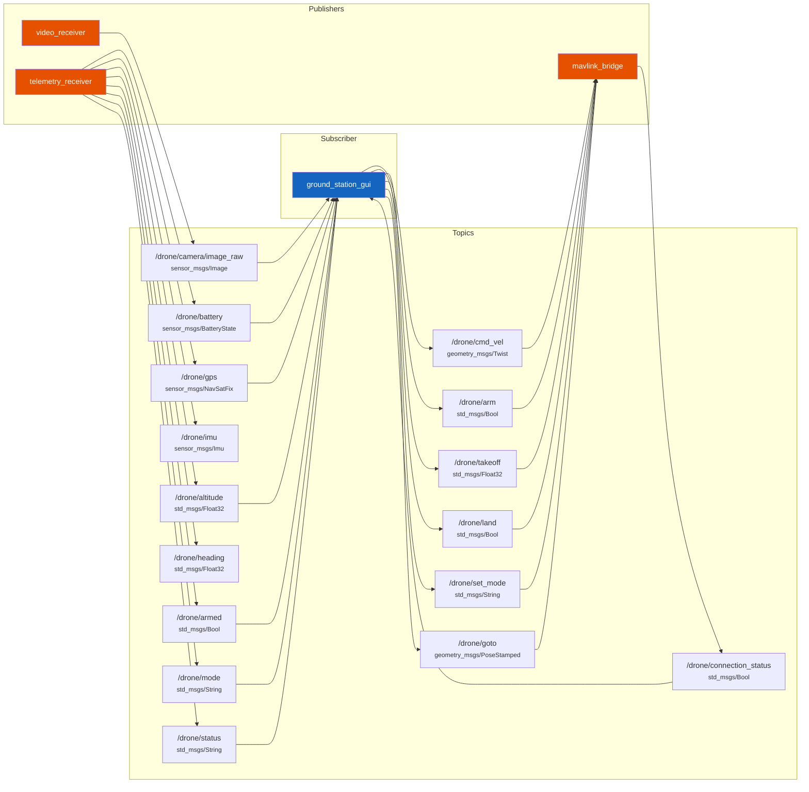
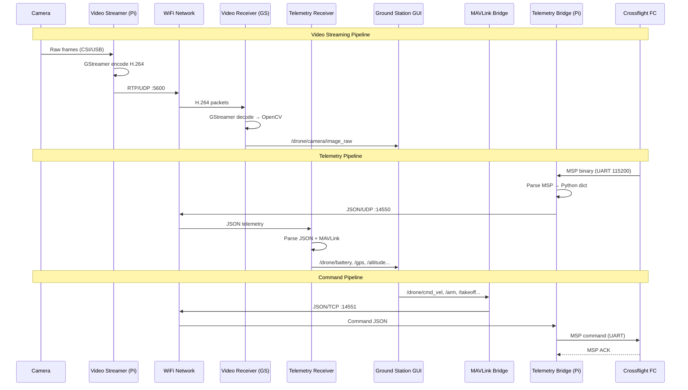
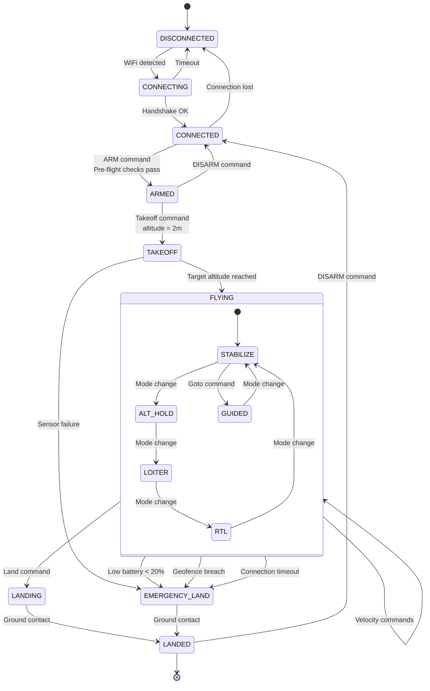
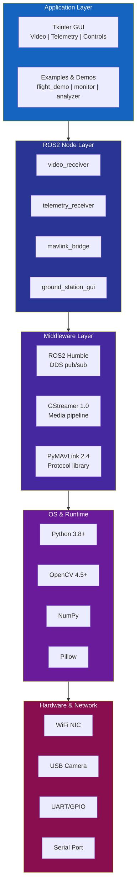
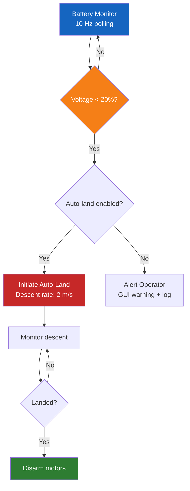

<p align="center">
  
</p>

<h1 align="center">Drone Ground Station</h1>

<p align="center">
  <em>A ROS2-powered ground control system for real-time drone telemetry, video streaming, and flight command — built for education and research</em>
</p>

<p align="center">
  
  
  
  
  
  
</p>

---

## Table of Contents

- [System Architecture](#-system-architecture)
- [Network Topology](#-network-topology)
- [ROS2 Topic Graph](#-ros2-topic-graph)
- [Data Flow](#-data-flow)
- [Flight State Machine](#-flight-state-machine)
- [Software Stack](#-software-stack)
- [Hardware Wiring](#-hardware-wiring)
- [Features](#-features)
- [Installation](#-installation)
- [Configuration](#-configuration)
- [GUI Layout](#-gui-layout)
- [API Reference](#-api-reference)
- [Project Structure](#-project-structure)
- [Performance](#-performance)
- [Safety Systems](#-safety-systems)
- [Troubleshooting](#-troubleshooting)
- [Documentation](#-documentation)
- [Contributing](#contributing)
- [License](#license)

---

## System Architecture



---

## Network Topology



---

## ROS2 Topic Graph



---

## Data Flow



---

## Flight State Machine



---

## Software Stack



---

## Hardware Wiring

```
  ┌──────────────────────────────────────────────────────────────┐
  │                    RASPBERRY PI 3 MODEL B+                   │
  │                                                              │
  │  ┌──────────────┐   CSI Ribbon    ┌───────────────────────┐  │
  │  │ Camera Module │◄══════════════►│ CSI Port              │  │
  │  │ (v2 / USB)   │   Cable         │                       │  │
  │  └──────────────┘                 │   ┌─────────────────┐ │  │
  │                                   │   │   BCM2837B0     │ │  │
  │                                   │   │   ARM Cortex-A53│ │  │
  │  ┌──────────────┐                 │   │   1.4 GHz       │ │  │
  │  │ WiFi Module  │◄───────────────►│   │                 │ │  │
  │  │ (AP Mode)    │  Internal       │   └─────────────────┘ │  │
  │  │ 192.168.4.1  │                 │                       │  │
  │  └──────────────┘                 │   GPIO Header         │  │
  │                                   │   ┌─────────────────┐ │  │
  │                                   │   │ Pin 8  (TXD) ──────────┐  │
  │                                   │   │ Pin 10 (RXD) ──────────┤  │
  │                                   │   │ Pin 6  (GND) ──────────┤  │
  │                                   │   └─────────────────┘ │  │
  │                                   └───────────────────────┘  │
  └──────────────────────────────────────────────────────────────┘
                                              │  │  │
                                   UART       │  │  │  115200 baud
                                   3.3V TTL   │  │  │  8N1
                                              │  │  │
  ┌──────────────────────────────────────────────────────────────┐
  │                    CROSSFLIGHT FC                             │
  │                                                              │
  │   ┌─────────────────┐         ┌──────────────────────────┐  │
  │   │ UART Port       │         │ Flight Controller MCU    │  │
  │   │ TX  ◄───────────────────── Pin 8 (Pi TXD)           │  │
  │   │ RX  ────────────────────►  Pin 10 (Pi RXD)          │  │
  │   │ GND ◄───────────────────── Pin 6 (Pi GND)           │  │
  │   └─────────────────┘         │                          │  │
  │                               │ MSP Protocol Handler     │  │
  │   ┌─────────────────┐        │ • Attitude estimation    │  │
  │   │ Sensors         │        │ • GPS processing        │  │
  │   │ • Gyroscope     │────────│ • Motor mixing          │  │
  │   │ • Accelerometer │        │ • PID control           │  │
  │   │ • Magnetometer  │        │ • Battery monitoring    │  │
  │   │ • Barometer     │        └──────────────────────────┘  │
  │   │ • GPS Module    │                                      │
  │   └─────────────────┘                                      │
  └──────────────────────────────────────────────────────────────┘
```

---

## Features

### Video System

| Feature | Status | Details |
|---------|--------|---------|
| H.264 Streaming | **Active** | GStreamer RTP pipeline |
| Resolution | **1280x720** | Configurable via YAML |
| Frame Rate | **30 FPS** | Adaptive drop under load |
| Bitrate | **2 Mbps** | Configurable per-flight |
| Low-latency Decode | **Active** | `avdec_h264` with `sync=false` |
| Frame Buffer | **2 frames** | Prevents memory buildup |

### Telemetry System

| Feature | Status | Details |
|---------|--------|---------|
| JSON Telemetry | **Active** | Custom format from Pi bridge |
| MAVLink Parsing | **Active** | HEARTBEAT, SYS_STATUS, GPS_RAW_INT, ATTITUDE, VFR_HUD, BATTERY_STATUS, GLOBAL_POSITION_INT |
| Update Rate | **10 Hz** | Configurable |
| GPS Tracking | **Active** | Lat/Lon/Alt + satellite count |
| IMU Data | **Active** | Roll/Pitch/Yaw |
| Battery Monitor | **Active** | Voltage/Current/Remaining % |
| Thread-Safe Access | **Active** | Locks on all shared state |

### Flight Control

| Feature | Status | Details |
|---------|--------|---------|
| Arm / Disarm | **Active** | Safety-gated |
| Takeoff | **Active** | Configurable altitude (default 2m) |
| Land | **Active** | Controlled descent |
| Emergency Stop | **Active** | Immediate disarm + zero velocity |
| Velocity Control | **Active** | 6-DOF via `cmd_vel` |
| Flight Modes | **Active** | STABILIZE, ALT_HOLD, LOITER, RTL, GUIDED |
| Goto Waypoint | **Active** | Position + orientation |

### Safety Systems

| Feature | Status | Details |
|---------|--------|---------|
| Geofence | **Active** | Max altitude 120m, max distance 500m |
| Low Battery Alert | **Active** | Threshold: 20% |
| Auto-Land | **Active** | On low battery trigger |
| Connection Watchdog | **Active** | 5s timeout → failsafe |
| Emergency Stop | **Active** | GUI button + keyboard shortcut |

---

## Installation

### Ground Station (Windows/Linux)

```bash
# 1. Install ROS2 Humble
# Follow: https://docs.ros.org/en/humble/Installation.html

# 2. Install Python dependencies
pip install pymavlink opencv-python Pillow numpy PyGObject pyyaml psutil

# 3. Install GStreamer
# Windows: https://gstreamer.freedesktop.org/download/
# Ubuntu: sudo apt install gstreamer1.0-tools gstreamer1.0-plugins-good gstreamer1.0-plugins-bad gstreamer1.0-libav

# 4. Clone and build
git clone https://github.com/husam05/Andhra-University-CSSE-Drone-Ground-Station.git
cd Andhra-University-CSSE-Drone-Ground-Station
cd src && colcon build && source install/setup.bash

# 5. Launch
ros2 launch drone_ground_station ground_station.launch.py
```

### Raspberry Pi 3

```bash
# 1. Flash Raspberry Pi OS Lite (64-bit)

# 2. Run automated setup
scp scripts/raspberry_pi_setup.sh pi@192.168.4.1:~/
ssh pi@192.168.4.1 'bash ~/raspberry_pi_setup.sh'

# 3. Install Python dependencies
pip install -r raspberry_pi_requirements.txt

# 4. Configure WiFi hotspot
sudo bash scripts/pi_network_fix.sh

# 5. Start drone services
cd raspberry_pi_scripts && python3 drone_startup.py
```

---

## Configuration

### Ground Station Parameters (`config/ground_station_params.yaml`)

| Section | Parameter | Type | Default | Description |
|---------|-----------|------|---------|-------------|
| `drone_connection` | `ip` | string | `192.168.4.1` | Drone WiFi IP |
| | `video_port` | int | `5600` | Video stream port |
| | `telemetry_port` | int | `14550` | Telemetry data port |
| | `command_port` | int | `14551` | Command channel port |
| | `connection_timeout` | float | `5.0` | Connection timeout (seconds) |
| `video_streaming` | `frame_rate` | int | `30` | Target FPS |
| | `video_width` | int | `1280` | Frame width (pixels) |
| | `video_height` | int | `720` | Frame height (pixels) |
| | `codec` | string | `h264` | Video codec |
| | `bitrate` | int | `2000000` | Bitrate (bps) |
| `telemetry` | `update_rate` | float | `10.0` | Publish rate (Hz) |
| | `timeout` | float | `2.0` | Data timeout (seconds) |
| | `protocol` | string | `mavlink` | `mavlink` or `json` |
| `flight_control` | `max_velocity.linear_x` | float | `5.0` | Max forward speed (m/s) |
| | `max_velocity.linear_z` | float | `3.0` | Max vertical speed (m/s) |
| | `default_takeoff_altitude` | float | `2.0` | Default takeoff height (m) |
| `safety` | `enable_geofence` | bool | `true` | Enable geofence |
| | `max_altitude` | float | `120.0` | Altitude ceiling (m) |
| | `max_distance` | float | `500.0` | Max range (m) |
| | `low_battery_threshold` | int | `20` | Battery alarm (%) |
| | `auto_land_on_low_battery` | bool | `true` | Auto-land trigger |

---

## GUI Layout

```
┌────────────────────────────────────────────────────────────────────┐
│                    Drone Ground Station                             │
├──────────────────────────────────┬─────────────────────────────────┤
│                                  │  TELEMETRY                      │
│                                  │  ─────────────────────────────  │
│        VIDEO FEED                │  Connection:  YES / NO          │
│                                  │  Armed:       YES / NO          │
│    ┌────────────────────────┐    │  Mode:        STABILIZE         │
│    │                        │    │  Battery:     85.0%             │
│    │   Live Camera Feed     │    │  Voltage:     12.60V            │
│    │   640 x 480 viewport   │    │  Altitude:    25.0m             │
│    │                        │    │  Speed:       3.5m/s            │
│    │   (H.264 decoded)      │    │  GPS Lat:     17.730000         │
│    │                        │    │  GPS Lon:     83.300000         │
│    └────────────────────────┘    │  Satellites:  12                │
│                                  │                                 │
├──────────────────────────────────┼─────────────────────────────────┤
│  FLIGHT CONTROLS                 │  SYSTEM STATUS                  │
│  ─────────────────────────────   │  ─────────────────────────────  │
│  [ ARM ] [TAKEOFF] [ LAND ]     │  [12:34:56] Connected to drone  │
│          [EMERGENCY]             │  [12:34:57] Telemetry OK        │
│                                  │  [12:35:01] Armed               │
│  Movement:    Altitude:          │  [12:35:02] Takeoff 2.0m        │
│      [↑]      [UP  ]            │  [12:35:10] Altitude reached    │
│   [←][■][→]   [DOWN]            │  [12:36:45] Land command sent   │
│      [↓]                        │  [12:36:52] Landed              │
│                                  │                                 │
└──────────────────────────────────┴─────────────────────────────────┘
```

---

## API Reference

### Published Topics (Ground Station → ROS2)

| Topic | Message Type | Rate | Description |
|-------|-------------|------|-------------|
| `/drone/camera/image_raw` | `sensor_msgs/Image` | 30 Hz | Decoded video frames (BGR8) |
| `/drone/battery` | `sensor_msgs/BatteryState` | 10 Hz | Voltage, current, remaining % |
| `/drone/gps` | `sensor_msgs/NavSatFix` | 10 Hz | Latitude, longitude, altitude |
| `/drone/imu` | `sensor_msgs/Imu` | 10 Hz | Orientation and angular velocity |
| `/drone/altitude` | `std_msgs/Float32` | 10 Hz | Relative altitude (meters) |
| `/drone/heading` | `std_msgs/Float32` | 10 Hz | Heading (degrees) |
| `/drone/armed` | `std_msgs/Bool` | 10 Hz | Armed state |
| `/drone/mode` | `std_msgs/String` | 10 Hz | Flight mode name |
| `/drone/status` | `std_msgs/String` | 10 Hz | Full telemetry JSON |
| `/drone/connection_status` | `std_msgs/Bool` | 0.5 Hz | TCP connection state |
| `/drone/command_ack` | `std_msgs/String` | Event | Command acknowledgment |

### Subscribed Topics (ROS2 → Ground Station)

| Topic | Message Type | Description |
|-------|-------------|-------------|
| `/drone/cmd_vel` | `geometry_msgs/Twist` | Velocity command (6-DOF) |
| `/drone/arm` | `std_msgs/Bool` | Arm (`true`) / Disarm (`false`) |
| `/drone/takeoff` | `std_msgs/Float32` | Takeoff to altitude (meters) |
| `/drone/land` | `std_msgs/Bool` | Land command |
| `/drone/set_mode` | `std_msgs/String` | Set flight mode |
| `/drone/goto` | `geometry_msgs/PoseStamped` | Navigate to position |

---

## Project Structure

```
Andhra-University-CSSE-Drone-Ground-Station/
├── src/drone_ground_station/           # ROS2 Package
│   ├── scripts/
│   │   ├── video_receiver.py           # GStreamer H.264 decoder node
│   │   ├── telemetry_receiver.py       # MAVLink + JSON telemetry node
│   │   ├── mavlink_bridge.py           # Command sender node
│   │   └── ground_station_gui.py       # Tkinter GUI node
│   ├── launch/
│   │   └── ground_station.launch.py    # ROS2 launch configuration
│   ├── config/
│   │   └── ground_station_params.yaml  # System parameters
│   ├── drone_ground_station/
│   │   └── __init__.py
│   ├── setup.py                        # Python package setup
│   ├── package.xml                     # ROS2 package manifest
│   └── CMakeLists.txt                  # Build configuration
│
├── raspberry_pi_scripts/               # Drone-side (Raspberry Pi 3)
│   ├── video_streamer.py               # Camera → H.264 → UDP
│   ├── telemetry_bridge.py             # FC ↔ UART ↔ UDP bridge
│   ├── drone_startup.py                # Boot service manager
│   └── config.json                     # Pi configuration
│
├── scripts/                            # Setup & testing utilities
│   ├── raspberry_pi_setup.sh           # Pi OS provisioning
│   ├── pi_network_fix.sh              # WiFi hotspot setup
│   ├── laptop_setup.py                 # Windows GS setup
│   ├── quick_start.py                  # Interactive wizard
│   ├── system_integration_test.py      # E2E system tests
│   └── remote_pi_setup.py             # Remote Pi provisioning
│
├── examples/                           # Demo scripts
│   ├── basic_flight_demo.py            # Flight command examples
│   ├── telemetry_monitor.py            # Real-time data viewer
│   ├── video_analyzer.py               # Stream analysis
│   └── integration_test.py             # Integration tests
│
├── Documentation/                      # Extended docs
│   ├── ARCHITECTURE.md                 # Deep architecture reference
│   ├── API_REFERENCE.md                # Complete API documentation
│   ├── DIAGRAMS.md                     # Visual diagram gallery
│   └── ...
│
├── requirements.txt                    # GS Python dependencies
├── raspberry_pi_requirements.txt       # Pi Python dependencies
├── deploy.py                           # Deployment automation
├── test_system.py                      # System test suite
├── CONTRIBUTING.md                     # Contribution guide
├── CHANGELOG.md                        # Version history
└── README.md                           # This file
```

---

## Performance

| Metric | Value | Notes |
|--------|-------|-------|
| Video Resolution | 1280 x 720 | Configurable |
| Video Frame Rate | 30 FPS | At source; display at 30 FPS |
| Video Bitrate | 2 Mbps | H.264 ultrafast preset |
| Video Latency | ~100-200 ms | End-to-end (camera → GUI) |
| Telemetry Rate | 10 Hz | Configurable up to 50 Hz |
| Command Rate | 10 Hz | TCP with JSON serialization |
| GUI Refresh | 10 Hz | Tkinter update cycle |
| WiFi Range | ~50-100 m | Depends on Pi antenna |
| Serial Baud Rate | 115200 | UART to Crossflight FC |
| MSP Cycle | ~100 ms | 9 MSP requests per cycle |

---

## Safety Systems

### Geofence

The system enforces a virtual boundary around the takeoff point:
- **Maximum altitude**: 120 meters (configurable)
- **Maximum horizontal distance**: 500 meters (configurable)
- **Breach action**: Automatic RTL (Return to Launch)

### Battery Protection



### Emergency Stop Sequence

1. GUI "EMERGENCY" button pressed
2. Disarm command sent immediately (`armed: false`)
3. All velocity commands zeroed
4. Command queue flushed
5. Status logged: `EMERGENCY STOP ACTIVATED`

### Connection Watchdog

- Telemetry timeout: **5 seconds**
- On timeout: log warning, attempt reconnect
- Persistent loss (>15s): trigger RTL if armed

---

## Troubleshooting

| Problem | Cause | Solution |
|---------|-------|----------|
| No video feed | GStreamer not installed | Install `gstreamer1.0-plugins-good gstreamer1.0-libav` |
| Video black screen | Wrong port or firewall | Check UDP 5600 is open, verify Pi IP |
| Telemetry timeout | Pi not streaming | SSH to Pi, check `telemetry_bridge.py` is running |
| Connection refused (TCP) | Command port blocked | Check TCP 14551, verify Pi firewall |
| GUI not launching | Missing Tkinter | `sudo apt install python3-tk` |
| `No camera detected` | Camera not connected | Check CSI ribbon cable or USB device |
| MSP checksum errors | Wiring issue | Verify TX↔RX crossover, check baud rate |
| Import error: `pymavlink` | Missing dependency | `pip install pymavlink>=2.4.0` |
| ROS2 topic not found | Node not running | `ros2 node list` to verify nodes |
| High latency video | Bitrate too high | Reduce `bitrate` in YAML config |

---

## Documentation

| Document | Description |
|----------|-------------|
| [ARCHITECTURE.md](ARCHITECTURE.md) | Deep technical architecture, thread models, protocol details |
| [API_REFERENCE.md](API_REFERENCE.md) | Complete API — ROS2 topics, MAVLink, MSP, JSON schemas |
| [DIAGRAMS.md](DIAGRAMS.md) | Visual gallery of 20+ Mermaid diagrams |
| [CONTRIBUTING.md](CONTRIBUTING.md) | How to contribute to this project |
| [CHANGELOG.md](CHANGELOG.md) | Version history and changes |
| [INSTALLATION.md](INSTALLATION.md) | Detailed installation guide |
| [QUICK_START.md](QUICK_START.md) | Quick launch procedures |
| [HARDWARE_WIRING_GUIDE.md](HARDWARE_WIRING_GUIDE.md) | Physical wiring reference |
| [DEPLOYMENT_CHECKLIST.md](DEPLOYMENT_CHECKLIST.md) | Pre-flight verification |

---

## Academic Information

| | |
|---|---|
| **Institution** | Andhra University |
| **Department** | Computer Science & Systems Engineering (CSSE) |
| **Project Type** | Research & Development |
| **Domains** | Distributed Systems, Computer Vision, Autonomous Vehicles, ROS2 |

This project serves as a practical implementation of:
- **Distributed systems** — ROS2 pub/sub across networked devices
- **Real-time data processing** — 30 FPS video + 10 Hz telemetry
- **Computer vision** — GStreamer/OpenCV pipeline
- **Embedded systems** — Raspberry Pi + UART + flight controller
- **Protocol engineering** — MAVLink, MSP, JSON, RTP
- **Safety-critical systems** — Geofencing, watchdogs, failsafes

---

## Contributing

See [CONTRIBUTING.md](CONTRIBUTING.md) for guidelines on submitting issues, features, and pull requests.

---

## License

This project is licensed under the MIT License — developed for educational and research purposes at **Andhra University, Department of Computer Science & Systems Engineering**.

---

<p align="center">
  <strong>Andhra University — Department of Computer Science & Systems Engineering</strong><br/>
  <em>Building the future of autonomous systems, one drone at a time</em>
</p>