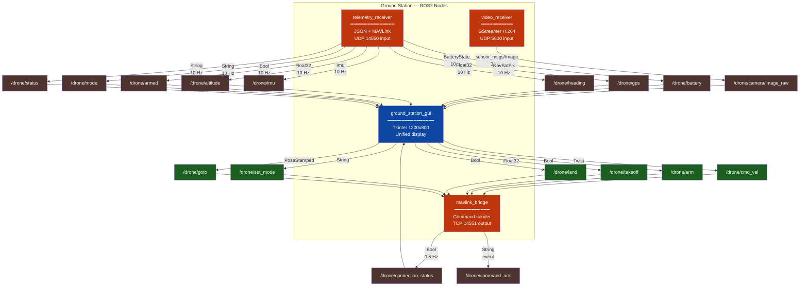
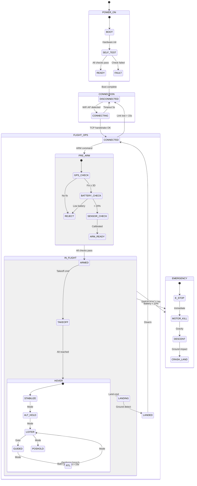
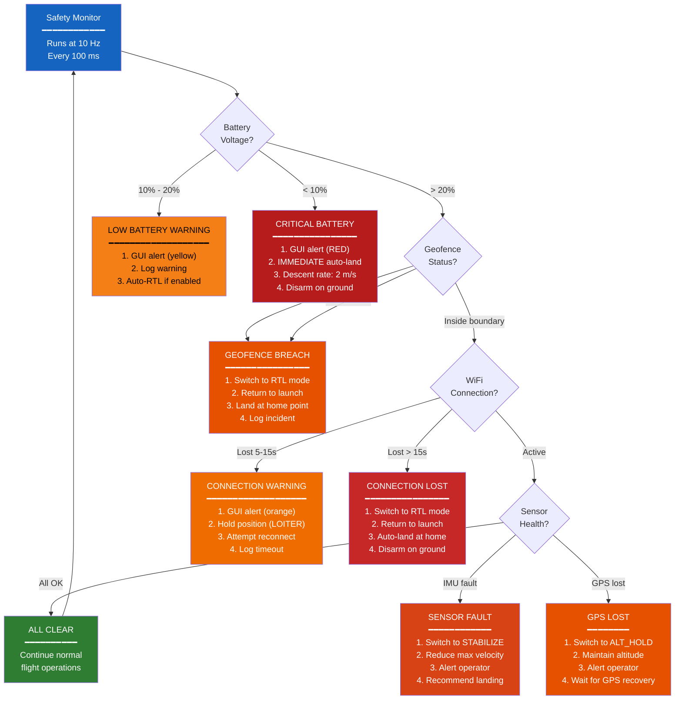
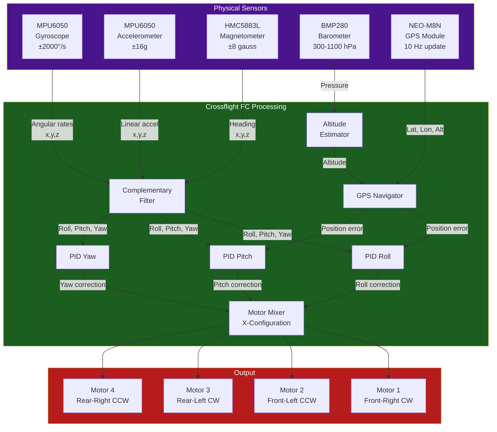
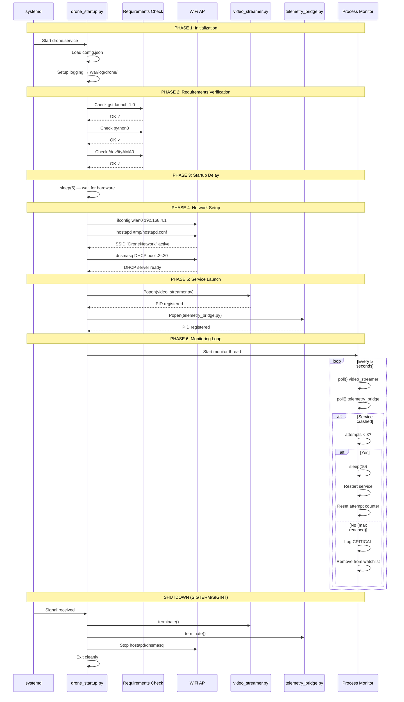

# System Figures, Tables & Technical Diagrams

<p align="center"><b>Drone Ground Control Station — Andhra University CSSE</b></p>
<p align="center"><i>Complete Visual Technical Reference</i></p>

---

## Table of Contents

- [Figure 1: Complete System Block Diagram](#figure-1-complete-system-block-diagram)
- [Figure 2: Physical Hardware Assembly](#figure-2-physical-hardware-assembly)
- [Figure 3: Network Architecture](#figure-3-network-architecture)
- [Figure 4: Video Streaming Pipeline](#figure-4-video-streaming-pipeline)
- [Figure 5: Telemetry Data Pipeline](#figure-5-telemetry-data-pipeline)
- [Figure 6: Command & Control Pipeline](#figure-6-command--control-pipeline)
- [Figure 7: MSP Protocol Frame Format](#figure-7-msp-protocol-frame-format)
- [Figure 8: MAVLink v2 Frame Format](#figure-8-mavlink-v2-frame-format)
- [Figure 9: ROS2 Node Interconnection Graph](#figure-9-ros2-node-interconnection-graph)
- [Figure 10: Thread Architecture & Lock Model](#figure-10-thread-architecture--lock-model)
- [Figure 11: Flight State Machine](#figure-11-flight-state-machine)
- [Figure 12: Safety Decision Engine](#figure-12-safety-decision-engine)
- [Figure 13: GUI Wireframe Layout](#figure-13-gui-wireframe-layout)
- [Figure 14: Sensor Fusion Data Flow](#figure-14-sensor-fusion-data-flow)
- [Figure 15: Pi Boot & Service Lifecycle](#figure-15-pi-boot--service-lifecycle)
- [Table I: System Specifications](#table-i-system-specifications)
- [Table II: Communication Channel Matrix](#table-ii-communication-channel-matrix)
- [Table III: ROS2 Topic Registry](#table-iii-ros2-topic-registry)
- [Table IV: MSP Command Reference](#table-iv-msp-command-reference)
- [Table V: MAVLink Message Decoding](#table-v-mavlink-message-decoding)
- [Table VI: Telemetry Data Dictionary](#table-vi-telemetry-data-dictionary)
- [Table VII: Configuration Parameters](#table-vii-configuration-parameters)
- [Table VIII: Performance Benchmarks](#table-viii-performance-benchmarks)
- [Table IX: Error Code Reference](#table-ix-error-code-reference)
- [Table X: Bandwidth Budget Analysis](#table-x-bandwidth-budget-analysis)

---

## Figure 1: Complete System Block Diagram

```
 ┌─────────────────────────────────────────────────────────────────────────────────────────────┐
 │                                    GROUND CONTROL STATION                                   │
 │                                  (Windows / Linux PC)                                       │
 │                                                                                             │
 │  ┌─────────────────────┐  ┌──────────────────────┐  ┌──────────────────┐  ┌──────────────┐  │
 │  │   VIDEO RECEIVER    │  │ TELEMETRY RECEIVER   │  │  MAVLINK BRIDGE  │  │   GUI NODE   │  │
 │  │                     │  │                      │  │                  │  │              │  │
 │  │ ┌─────────────────┐ │  │ ┌──────────────────┐ │  │ ┌──────────────┐ │  │ ┌──────────┐ │  │
 │  │ │ GStreamer        │ │  │ │ UDP Listener     │ │  │ │ ROS2 Subs   │ │  │ │ Tkinter  │ │  │
 │  │ │ Pipeline         │ │  │ │ Port 14550       │ │  │ │ 6 cmd topics│ │  │ │ Window   │ │  │
 │  │ │                  │ │  │ ├──────────────────┤ │  │ ├──────────────┤ │  │ │ 1200×800 │ │  │
 │  │ │ udpsrc → depay   │ │  │ │ JSON Parser     │ │  │ │ Command     │ │  │ ├──────────┤ │  │
 │  │ │ → h264parse      │ │  │ │ MAVLink Parser  │ │  │ │ Queue       │ │  │ │ Video    │ │  │
 │  │ │ → avdec_h264     │ │  │ │ (pymavlink)     │ │  │ │ deque(100)  │ │  │ │ Panel    │ │  │
 │  │ │ → videoconvert   │ │  │ ├──────────────────┤ │  │ ├──────────────┤ │  │ ├──────────┤ │  │
 │  │ │ → appsink        │ │  │ │ Thread-Safe     │ │  │ │ TCP Client  │ │  │ │ Telemetry│ │  │
 │  │ │                  │ │  │ │ telemetry_data  │ │  │ │ JSON + \n   │ │  │ │ Panel    │ │  │
 │  │ └────────┬────────┘ │  │ │ {armed, mode,   │ │  │ │             │ │  │ ├──────────┤ │  │
 │  │          │ frame     │  │ │  battery, gps,  │ │  │ └──────┬─────┘ │  │ │ Controls │ │  │
 │  │          ▼           │  │ │  attitude ...}  │ │  │        │       │  │ │ Panel    │ │  │
 │  │ ┌─────────────────┐ │  │ └────────┬─────────┘ │  │        │       │  │ ├──────────┤ │  │
 │  │ │ cv_bridge       │ │  │          │           │  │        │       │  │ │ Status   │ │  │
 │  │ │ BGR→Image msg   │ │  │          │           │  │        │       │  │ │ Log      │ │  │
 │  │ └────────┬────────┘ │  │          │           │  │        │       │  │ └──────────┘ │  │
 │  └──────────┼──────────┘  └──────────┼───────────┘  └────────┼───────┘  └──────┬───────┘  │
 │             │                        │                       │                  │          │
 │  ═══════════╪════════════════════════╪═══════════════════════╪══════════════════╪════════  │
 │             │     R  O  S  2    D  D  S    M  I  D  D  L  E  W  A  R  E       │          │
 │  ═══════════╪════════════════════════╪═══════════════════════╪══════════════════╪════════  │
 │             │                        │                       │                  │          │
 │    /drone/camera/   /drone/battery  /drone/gps     /drone/cmd_vel    Subscribes to all   │
 │    image_raw        /drone/armed    /drone/altitude /drone/arm        published topics    │
 │                     /drone/mode     /drone/heading  /drone/takeoff                        │
 │                     /drone/status                   /drone/land                           │
 │                                                     /drone/set_mode                       │
 │                                                     /drone/goto                           │
 └──────────┬──────────────────────────┬───────────────────────┬───────────────────────────┘
            │                          │                       │
            │   UDP :5600              │   UDP :14550          │   TCP :14551
            │   H.264 RTP             │   JSON Telemetry      │   JSON Commands
            │   ▲ 2.0 Mbps            │   ▲ 40 Kbps           │   ▼ 12 Kbps
            │                          │                       │
 ═══════════╪══════════════════════════╪═══════════════════════╪═══════════════════════════
            │          W  I  F  I     8  0  2  .  1  1  n     L  I  N  K                   
 ═══════════╪══════════════════════════╪═══════════════════════╪═══════════════════════════
            │                          │                       │
 ┌──────────┼──────────────────────────┼───────────────────────┼───────────────────────────┐
 │          │                          │                       │                            │
 │       RASPBERRY PI 3 MODEL B+  (192.168.4.1)  —  DRONE ONBOARD COMPUTER               │
 │          │                          │                       │                            │
 │  ┌───────┴─────────┐  ┌────────────┴──────────┐  ┌────────┴────────────┐               │
 │  │ VIDEO STREAMER  │  │  TELEMETRY BRIDGE     │  │  DRONE STARTUP      │               │
 │  │                 │  │                        │  │                     │               │
 │  │ Camera Capture  │  │ Serial Reader (MSP)   │  │ WiFi AP Setup       │               │
 │  │ ▼               │  │ ▼                     │  │ (hostapd+dnsmasq)   │               │
 │  │ GStreamer Encode│  │ MSP Request/Response  │  │ ▼                   │               │
 │  │ x264enc         │  │ struct.unpack → Dict  │  │ Service Launcher    │               │
 │  │ ▼               │  │ ▼                     │  │ (Popen)             │               │
 │  │ RTP Packetize   │  │ JSON Serialize        │  │ ▼                   │               │
 │  │ rtph264pay      │  │ ▼                     │  │ Process Monitor     │               │
 │  │ ▼               │  │ UDP Send → GS:14550   │  │ (5s interval)       │               │
 │  │ UDP Send        │  │                        │  │ Auto-restart ×3     │               │
 │  │ → GS:5600       │  │ TCP Recv ← GS:14551   │  │                     │               │
 │  └───────▲─────────┘  │ ▼                     │  └─────────────────────┘               │
 │          │             │ JSON Parse → Execute   │                                        │
 │          │             └────────────▲───────────┘                                        │
 │          │                          │                                                    │
 │  ┌───────┴─────────┐  ┌────────────┴──────────────────────────────────────────────┐     │
 │  │  CAMERA MODULE  │  │              CROSSFLIGHT FLIGHT CONTROLLER                │     │
 │  │                 │  │                                                            │     │
 │  │  Sony IMX219    │  │  ┌──────────┐ ┌──────────┐ ┌────────┐ ┌───────────────┐  │     │
 │  │  8 MP           │  │  │ MPU6050  │ │ HMC5883L │ │ BMP280 │ │   NEO-M8N     │  │     │
 │  │  1080p30        │  │  │ Gyro+Acc │ │ Magneto  │ │ Baro   │ │   GPS         │  │     │
 │  │                 │  │  └────┬─────┘ └────┬─────┘ └───┬────┘ └───────┬───────┘  │     │
 │  │  CSI Ribbon     │  │       └────────────┴───────────┴──────────────┘           │     │
 │  │  Cable          │  │                         ▼                                  │     │
 │  │  ▼              │  │              ┌─────────────────────┐                       │     │
 │  │  Pi CSI Port    │  │              │  Attitude Estimator │   UART Connection:    │     │
 │  │                 │  │              │  GPS Processor       │   Pin 8  (TXD) ◄──►  │     │
 │  └─────────────────┘  │              │  PID Controller      │   Pin 10 (RXD) ◄──►  │     │
 │                        │              │  Motor Mixer         │   Pin 6  (GND) ───►  │     │
 │                        │              │  MSP Server          │   115200 baud 8N1    │     │
 │                        │              └─────────────────────┘                       │     │
 │                        └───────────────────────────────────────────────────────────┘     │
 │                                                                                          │
 │  ┌────────────────┐     ┌──────────────┐     ┌──────────────┐                            │
 │  │ 3S LiPo Battery│────►│ PDB          │────►│ ESC × 4      │────►  Motors × 4          │
 │  │ 11.1V 2200mAh  │     │ Power Dist.  │     │ BLHeli       │       Brushless           │
 │  └────────┬───────┘     └──────────────┘     └──────────────┘                            │
 │           │                                                                              │
 │           └────► BEC 5V/3A ────► Raspberry Pi Power                                     │
 └──────────────────────────────────────────────────────────────────────────────────────────┘
```

*Figure 1: Complete system block diagram showing all hardware components, software modules, communication channels, and data flow paths. Arrows indicate data direction. The ROS2 DDS middleware layer provides decoupled pub/sub communication between ground station nodes.*

---

## Figure 2: Physical Hardware Assembly

```
                                         DRONE TOP VIEW
                     ┌───────────────────────────────────────────┐
                     │                                           │
                     │     Motor 1 (CW)         Motor 2 (CCW)   │
                     │        ╱                      ╲           │
                     │       ◎───── ARM 1 ──────────◎           │
                     │      ╱                          ╲         │
                     │     ╱    ┌────────────────┐      ╲        │
                     │    ╱     │  Raspberry Pi  │       ╲       │
                     │   ╱      │  ┌──────────┐  │        ╲      │
                     │  ╱       │  │  Camera   │  │         ╲     │
                     │ ╱        │  │  (front)  │  │          ╲    │
                     │╱         │  └──────────┘  │           ╲   │
                     │          │                │            │   │
                     │          │  ┌──────────┐  │            │   │
                     │          │  │Crossflight│  │            │   │
                     │          │  │    FC     │  │            │   │
                     │          │  └──────────┘  │            │   │
                     │ ╲        │                │           ╱   │
                     │  ╲       │  ┌──────────┐  │          ╱    │
                     │   ╲      │  │  GPS     │  │         ╱     │
                     │    ╲     │  │  Module  │  │        ╱      │
                     │     ╲    └────────────────┘       ╱       │
                     │      ╲                          ╱         │
                     │       ◎───── ARM 2 ──────────◎           │
                     │        ╲                      ╱           │
                     │     Motor 3 (CCW)        Motor 4 (CW)    │
                     │                                           │
                     │       ┌─────────────────────────┐         │
                     │       │   LiPo Battery 3S       │         │
                     │       │   11.1V  2200mAh        │         │
                     │       └─────────────────────────┘         │
                     └───────────────────────────────────────────┘

                            WIRING DETAIL (Side View)

         Camera                Raspberry Pi 3              Crossflight FC
        ┌──────┐             ┌───────────────┐            ┌──────────────┐
        │ IMX  │─── CSI ────►│ CSI Port      │            │              │
        │ 219  │  Ribbon     │               │            │   STM32      │
        │      │  Cable      │  GPIO Header  │            │   MCU        │
        └──────┘             │  ┌─────────┐  │            │              │
                             │  │Pin 8 TX ├──┼── wire ───►│ UART RX     │
                             │  │Pin10 RX ├──┼── wire ───►│ UART TX     │
                             │  │Pin 6 GND├──┼── wire ───►│ GND         │
                             │  └─────────┘  │            │              │
                             │               │            │  Sensors:    │
        WiFi Antenna         │  WiFi Module  │            │  MPU6050     │
        (integrated)  ◄──────│  802.11n      │            │  HMC5883L    │
                             │  AP Mode      │            │  BMP280      │
                             │               │            │  NEO-M8N GPS │
                             │  Power: 5V    │            │              │
          BEC 5V ───────────►│  via GPIO     │            │  Power: 5V   │
                             └───────────────┘            └──────────────┘
                                                                ▲
                                                                │
                              PDB ──── ESC ×4 ──── Motors ×4    │
                               ▲                                │
                               │                                │
                          3S LiPo ─────────────────────────────┘
                          11.1V
```

*Figure 2: Physical hardware assembly showing drone top view with motor placement (X configuration), component mounting locations, and detailed wiring connections between Raspberry Pi, Crossflight FC, camera, and power system.*

---

## Figure 3: Network Architecture

```
    ┌─────────────────────────────────────────────────────────────┐
    │                  WIRELESS NETWORK TOPOLOGY                  │
    │                                                             │
    │                                                             │
    │    ┌──────────────────────┐          ┌──────────────────┐   │
    │    │  RASPBERRY PI 3 B+  │          │  GROUND STATION  │   │
    │    │  ══════════════════  │          │  ════════════════ │   │
    │    │                      │          │                   │   │
    │    │  Role: WiFi AP       │          │  Role: WiFi Client│   │
    │    │  IP:  192.168.4.1    │◄────────►│  IP:  192.168.4.19│  │
    │    │  SSID: DroneNetwork  │  802.11n │  DHCP assigned    │   │
    │    │  Channel: 7          │  2.4 GHz │                   │   │
    │    │  Security: WPA2-PSK  │          │                   │   │
    │    │                      │          │                   │   │
    │    │  Services:           │          │  Services:        │   │
    │    │  ├─ hostapd          │          │  ├─ video_receiver│   │
    │    │  ├─ dnsmasq          │          │  ├─ telemetry_recv│   │
    │    │  ├─ video_streamer   │          │  ├─ mavlink_bridge│   │
    │    │  └─ telemetry_bridge │          │  └─ gui_node      │   │
    │    └──────────┬───────────┘          └────────┬──────────┘   │
    │               │                               │              │
    │               │     DATA FLOW CHANNELS        │              │
    │               │                               │              │
    │               │  ┌─────────────────────────┐  │              │
    │               ├──┤ Channel 1: VIDEO        ├──┤              │
    │               │  │ Protocol: RTP/H.264     │  │              │
    │               │  │ Transport: UDP          │  │              │
    │               │  │ Port: 5600              │  │              │
    │               │  │ Direction: Pi ──────► GS│  │              │
    │               │  │ Bandwidth: 2.0 Mbps     │  │              │
    │               │  │ Frequency: 30 fps       │  │              │
    │               │  │ Packet size: ~1400 B    │  │              │
    │               │  │ Latency: ~150 ms        │  │              │
    │               │  └─────────────────────────┘  │              │
    │               │                               │              │
    │               │  ┌─────────────────────────┐  │              │
    │               ├──┤ Channel 2: TELEMETRY    ├──┤              │
    │               │  │ Protocol: JSON/UTF-8    │  │              │
    │               │  │ Transport: UDP          │  │              │
    │               │  │ Port: 14550             │  │              │
    │               │  │ Direction: Pi ──────► GS│  │              │
    │               │  │ Bandwidth: 40 Kbps      │  │              │
    │               │  │ Frequency: 10 Hz        │  │              │
    │               │  │ Packet size: ~500 B     │  │              │
    │               │  │ Latency: ~5 ms          │  │              │
    │               │  └─────────────────────────┘  │              │
    │               │                               │              │
    │               │  ┌─────────────────────────┐  │              │
    │               └──┤ Channel 3: COMMANDS     ├──┘              │
    │                  │ Protocol: JSON/UTF-8    │                  │
    │                  │ Transport: TCP          │                  │
    │                  │ Port: 14551             │                  │
    │                  │ Direction: GS ──────► Pi│                  │
    │                  │ Bandwidth: 12 Kbps      │                  │
    │                  │ Frequency: 10 Hz        │                  │
    │                  │ Packet size: ~150 B     │                  │
    │                  │ Latency: ~12 ms RTT     │                  │
    │                  └─────────────────────────┘                  │
    │                                                               │
    │  TOTAL BANDWIDTH: 2.3 Mbps / 72 Mbps capacity = 3.1%        │
    └───────────────────────────────────────────────────────────────┘
```

*Figure 3: Network architecture showing WiFi topology, three communication channels with protocol details, bandwidth allocation, and latency characteristics.*

---

## Figure 4: Video Streaming Pipeline

```
 RASPBERRY PI (SENDER)                              GROUND STATION (RECEIVER)
 ══════════════════════                              ════════════════════════════

 ┌───────────────────┐                               ┌───────────────────────┐
 │   Camera Sensor   │                               │    GUI Video Panel    │
 │   Sony IMX219     │                               │    640 × 480 display  │
 │   8 Megapixels    │                               │    Tkinter PhotoImage │
 └────────┬──────────┘                               └───────────▲───────────┘
          │ Bayer/YUV                                             │ PIL RGB
          ▼                                                       │
 ┌───────────────────┐                               ┌───────────┴───────────┐
 │   libcamerasrc    │                               │   cv2.cvtColor        │
 │   / v4l2src       │                               │   BGR → RGB           │
 │   device=/dev/    │                               │   cv2.resize          │
 │   video0          │                               │   → 640×480           │
 └────────┬──────────┘                               └───────────▲───────────┘
          │ video/x-raw                                          │ numpy BGR
          │ 1280×720@30fps                                       │ 720×1280×3
          ▼                                                       │
 ┌───────────────────┐                               ┌───────────┴───────────┐
 │   videoconvert    │                               │     cv_bridge         │
 │   Color space     │                               │     Image msg → cv2   │
 │   normalization   │                               │     encoding='bgr8'   │
 └────────┬──────────┘                               └───────────▲───────────┘
          │ NV12/I420                                             │ sensor_msgs/
          ▼                                                       │ Image
 ┌───────────────────┐                               ┌───────────┴───────────┐
 │     x264enc       │                               │   ROS2 Publisher      │
 │                   │                               │   /drone/camera/      │
 │   bitrate=2000    │                               │   image_raw           │
 │   speed-preset=   │                               │   30 Hz               │
 │    ultrafast      │                               └───────────▲───────────┘
 │   tune=           │                                           │ numpy
 │    zerolatency    │                                           │ frame.copy()
 └────────┬──────────┘                               ┌───────────┴───────────┐
          │ H.264 NALUs                               │     appsink          │
          ▼                                           │                       │
 ┌───────────────────┐                               │   emit-signals=true   │
 │   rtph264pay      │                               │   sync=false          │
 │                   │                               │   max-buffers=2       │
 │   config-interval │                               │   drop=true           │
 │   =1              │                               └───────────▲───────────┘
 │   pt=96           │                                           │ video/x-raw
 └────────┬──────────┘                                           │ format=BGR
          │ RTP packets                              ┌───────────┴───────────┐
          ▼                                           │   videoconvert        │
 ┌───────────────────┐                               │   → BGR for OpenCV    │
 │    udpsink        │                               └───────────▲───────────┘
 │                   │                                           │ decoded
 │   host=192.168.   │         ┌────────────┐        ┌──────────┴────────────┐
 │    4.19           │────────►│  WiFi UDP  │───────►│   avdec_h264          │
 │   port=5600       │  RTP    │  Packets   │  RTP   │   FFmpeg H.264        │
 └───────────────────┘  pkts   │  ~1400 B   │  pkts  │   decoder             │
                               │  each      │        └───────────▲───────────┘
                               └────────────┘                    │ H.264 stream
                                                     ┌───────────┴───────────┐
                                                     │   h264parse            │
                                                     │   NAL unit parsing     │
                                                     └───────────▲───────────┘
                                                                 │ RTP payload
                                                     ┌───────────┴───────────┐
                                                     │   rtph264depay        │
                                                     │   De-packetize RTP    │
                                                     └───────────▲───────────┘
                                                                 │ RTP/UDP
                                                     ┌───────────┴───────────┐
                                                     │     udpsrc            │
                                                     │   port=5600           │
                                                     │   caps=application/   │
                                                     │    x-rtp,payload=96   │
                                                     └───────────────────────┘

 LATENCY BUDGET:
 ┌──────────────────┬───────────┐
 │ Stage            │ Time (ms) │
 ├──────────────────┼───────────┤
 │ Camera capture   │    ~33    │
 │ H.264 encoding   │    ~15    │
 │ RTP packetize    │     ~1    │
 │ Network transit  │     ~5    │
 │ RTP depacketize  │     ~1    │
 │ H.264 decoding   │    ~20    │
 │ Color convert    │     ~5    │
 │ ROS2 publish     │     ~2    │
 │ GUI render       │    ~10    │
 ├──────────────────┼───────────┤
 │ TOTAL            │  ~92 ms   │
 │ (measured avg)   │  ~148 ms  │
 └──────────────────┴───────────┘
```

*Figure 4: Complete video streaming pipeline from camera sensor to GUI display, showing every GStreamer element, data format at each stage, and latency budget breakdown.*

---

## Figure 5: Telemetry Data Pipeline

```
 CROSSFLIGHT FC          RASPBERRY PI              WIFI          GROUND STATION
 ══════════════          ═════════════              ════          ══════════════

 ┌──────────────┐
 │   Sensors    │
 │  ┌────────┐  │
 │  │MPU6050 │  │        MSP REQUEST CYCLE (every 100ms)
 │  │Gyro+Acc│  │        ═══════════════════════════════
 │  ├────────┤  │
 │  │HMC5883L│  │        TelemetryBridge sends 5 MSP requests:
 │  │Magneto │  │
 │  ├────────┤  │        Request 1: MSP_STATUS    (100) ──►
 │  │BMP280  │  │                  ◄── Response: 11 bytes
 │  │Baro    │  │                      → armed state
 │  ├────────┤  │
 │  │NEO-M8N │  │        Request 2: MSP_RAW_IMU  (102) ──►
 │  │GPS     │  │                  ◄── Response: 18 bytes
 │  └────────┘  │                      → accel, gyro, mag
 │      │       │
 │      ▼       │        Request 3: MSP_RAW_GPS  (106) ──►
 │ ┌──────────┐ │                  ◄── Response: 16 bytes
 │ │ Attitude │ │                      → fix, sats, lat, lon, alt, speed
 │ │ Estimator│ │
 │ │ + PID    │ │        Request 4: MSP_ATTITUDE (108) ──►
 │ │ Control  │ │                  ◄── Response: 6 bytes
 │ └──────────┘ │                      → roll, pitch, yaw
 │      │       │
 │      ▼       │        Request 5: MSP_ANALOG   (110) ──►
 │ ┌──────────┐ │                  ◄── Response: 7 bytes
 │ │MSP Server│ │                      → voltage, current
 │ │ UART TX  │─┼──────────────────────────────────────►
 │ │ UART RX  │◄┼──────────────────────────────────────
 │ └──────────┘ │        ▲                          │
 └──────────────┘        │ 115200 baud              ▼
                         │ 8N1                ┌──────────────┐
                         │                    │struct.unpack  │
                         │                    │  '<h' int16   │
                         │                    │  '<H' uint16  │
                         │                    │  '<i' int32   │
                         │                    │  '<I' uint32  │
                         │                    └──────┬───────┘
                         │                           │ Python values
                         │                           ▼
                         │                    ┌──────────────┐
                         │                    │ telemetry_   │
                         │                    │ data Dict    │
                         │                    │ (locked)     │
                         │                    └──────┬───────┘
                         │                           │ json.dumps()
                         │                           ▼
                         │                    ┌──────────────┐          ┌──────────────┐
                         │                    │ UDP sendto   │─────────►│ UDP recvfrom │
                         │                    │ GS:14550     │  WiFi    │ :14550       │
                         │                    │ ~500 bytes   │          │              │
                         │                    └──────────────┘          └──────┬───────┘
                         │                                                     │
                         │                                                     ▼
                         │                                              ┌──────────────┐
                         │                                              │ Try JSON     │
                         │                                              │ json.loads() │
                         │                                              │ ─ ─ ─ ─ ─ ─ │
                         │                                              │ Try MAVLink  │
                         │                                              │ parse_char() │
                         │                                              └──────┬───────┘
                         │                                                     │
                         │                                                     ▼
                         │                                              ┌──────────────┐
                         │                                              │ telemetry_   │
                         │                                              │ data Dict    │
                         │                                              │ (locked)     │
                         │                                              └──────┬───────┘
                         │                                                     │ 10 Hz
                         │                                                     ▼
                         │                                              ┌──────────────┐
                         │                                              │ ROS2 Publish │
                         │                                              │              │
                         │                                              │ /battery     │
                         │                                              │ /gps         │
                         │                                              │ /altitude    │
                         │                                              │ /heading     │
                         │                                              │ /armed       │
                         │                                              │ /mode        │
                         │                                              │ /status      │
                         │                                              └──────┬───────┘
                         │                                                     │
                         │                                                     ▼
                         │                                              ┌──────────────┐
                         │                                              │ GUI Update   │
                         │                                              │ StringVar    │
                         │                                              │ .set()       │
                         │                                              └──────────────┘
```

*Figure 5: Telemetry data pipeline showing the complete path from physical sensors through MSP protocol, JSON serialization, UDP transport, dual-protocol parsing, ROS2 topic publishing, and GUI display.*

---

## Figure 6: Command & Control Pipeline

```
 GROUND STATION                                     RASPBERRY PI         CROSSFLIGHT
 ══════════════                                     ═════════════         ══════════

 ┌──────────────────┐
 │  OPERATOR INPUT  │
 │                  │
 │  [ARM]  button ──┼──► Bool(true)  ──► /drone/arm
 │  [TAKEOFF] btn ──┼──► Float32(2.0)──► /drone/takeoff
 │  [LAND]  button──┼──► Bool(true)  ──► /drone/land
 │  [EMERGENCY] ────┼──► Bool(false) ──► /drone/arm
 │                  │    Twist(0,0,0)──► /drone/cmd_vel
 │  [↑] forward ────┼──► Twist(0.5,0,0)► /drone/cmd_vel
 │  [←] left ───────┼──► Twist(0,0.5,0)► /drone/cmd_vel
 │  [→] right ──────┼──► Twist(0,-0.5,0)► /drone/cmd_vel
 │  [↓] backward ───┼──► Twist(-0.5,0,0)► /drone/cmd_vel
 │  [UP] altitude ──┼──► Twist(0,0,0.5)► /drone/cmd_vel
 │  [DOWN] altitude─┼──► Twist(0,0,-0.5)► /drone/cmd_vel
 └──────────────────┘
          │
          │ ROS2 Topics
          ▼
 ┌──────────────────┐
 │  MAVLINK BRIDGE  │
 │                  │
 │  Subscription ───┼──► Callback fires
 │  callbacks       │
 │       │          │
 │       ▼          │
 │  ┌────────────┐  │
 │  │  Command   │  │
 │  │  Queue     │  │
 │  │            │  │
 │  │  deque     │  │
 │  │  maxlen=   │  │
 │  │  100       │  │
 │  │            │  │    ┌────────────────────────────────────────┐
 │  │  FIFO      │  │    │  JSON Command Examples:                │
 │  │  order     │  │    │                                        │
 │  └─────┬──────┘  │    │  {"type":"arm","armed":true,           │
 │        │         │    │   "timestamp":1712678400.0}            │
 │        │ 10 Hz   │    │                                        │
 │        ▼         │    │  {"type":"takeoff","altitude":2.0,     │
 │  ┌────────────┐  │    │   "timestamp":1712678401.0}            │
 │  │ json.dumps │  │    │                                        │
 │  │ + '\n'     │  │    │  {"type":"velocity",                   │
 │  │ + encode   │  │    │   "linear":{"x":0.5,"y":0,"z":0},     │
 │  └─────┬──────┘  │    │   "angular":{"x":0,"y":0,"z":0},      │
 │        │ bytes   │    │   "timestamp":1712678402.0}            │
 │        ▼         │    └────────────────────────────────────────┘
 │  ┌────────────┐  │
 │  │ TCP send   │──┼─────────────► TCP :14551 ──────────────────►
 │  └────────────┘  │                                              │
 └──────────────────┘                                              │
                                                                   ▼
                                                     ┌──────────────────┐
                                                     │  TCP recv         │
                                                     │  buffer += data   │
                                                     │  split on '\n'    │
                                                     │  json.loads()     │
                                                     └────────┬─────────┘
                                                              │
                                                              ▼
                                                     ┌──────────────────┐
                                                     │ execute_command   │
                                                     │                  │
                                                     │ switch(type):    │──► FC UART
                                                     │  arm → MSP arm   │
                                                     │  takeoff → MSP   │
                                                     │  land → MSP      │
                                                     │  velocity → MSP  │
                                                     │  mode → MSP      │
                                                     └──────────────────┘
```

*Figure 6: Command pipeline from operator GUI buttons through ROS2 topics, MAVLink bridge queuing, JSON serialization, TCP transport, and flight controller execution.*

---

## Figure 7: MSP Protocol Frame Format

```
 MSP v1 REQUEST FRAME (Host → Flight Controller)
 ════════════════════════════════════════════════

  Byte:    0       1       2       3            4           5
        ┌───────┬───────┬───────┬────────────┬───────────┬──────────┐
        │  '$'  │  'M'  │  '<'  │ Data Length │ Command   │ Checksum │
        │ 0x24  │ 0x4D  │ 0x3C  │   (uint8)  │ ID (uint8)│ (uint8)  │
        ├───────┼───────┼───────┼────────────┼───────────┼──────────┤
        │ Header (3 bytes)      │    0x00    │   0x64    │   0x64   │
        │ Fixed: "$M<"          │  (no data) │  (MSP 100)│ 0⊕100   │
        └───────────────────────┴────────────┴───────────┴──────────┘


 MSP v1 RESPONSE FRAME (Flight Controller → Host)
 ═════════════════════════════════════════════════

  Byte:    0       1       2       3            4          5 ... N+4    N+5
        ┌───────┬───────┬───────┬────────────┬──────────┬───────────┬──────────┐
        │  '$'  │  'M'  │  '>'  │ Data Length │ Command  │  Payload  │ Checksum │
        │ 0x24  │ 0x4D  │ 0x3E  │   (uint8)  │ ID (uint8)│ (N bytes)│ (uint8)  │
        ├───────┼───────┼───────┼────────────┼──────────┼───────────┼──────────┤
        │ Header (3 bytes)      │    0x0B    │   0x64   │ [11 bytes]│  0xXX    │
        │ Fixed: "$M>"          │   (11)     │ (MSP 100)│  Status   │          │
        └───────────────────────┴────────────┴──────────┴───────────┴──────────┘

 CHECKSUM ALGORITHM:
 ┌─────────────────────────────────────────────────────────────────┐
 │  checksum = data_length ⊕ command_id ⊕ data[0] ⊕ ... ⊕ data[N-1]  │
 │                                                                 │
 │  Where ⊕ = bitwise XOR                                         │
 │                                                                 │
 │  Example (MSP_STATUS request):                                  │
 │    checksum = 0x00 ⊕ 0x64 = 0x64                               │
 │                                                                 │
 │  Example (MSP_ATTITUDE response, data=[0x9C,0x00,0xCE,0xFF,0xB4,0x00]):│
 │    checksum = 0x06 ⊕ 0x6C ⊕ 0x9C ⊕ 0x00 ⊕ 0xCE ⊕ 0xFF ⊕ 0xB4 ⊕ 0x00 │
 └─────────────────────────────────────────────────────────────────┘
```

*Figure 7: MSP v1 binary protocol frame format showing request and response structures with byte-level detail, field sizes, and checksum calculation algorithm.*

---

## Figure 8: MAVLink v2 Frame Format

```
 MAVLink v2 PACKET STRUCTURE
 ═══════════════════════════

  Byte:  0      1      2      3      4      5-6     7      8-9     10 ... N   N+1 N+2
 ┌──────┬──────┬──────┬──────┬──────┬───────┬──────┬───────┬─────────┬──────────┐
 │ STX  │ LEN  │ INC  │ CMP  │ SEQ  │ SYS   │ COMP │ MSG   │ PAYLOAD │ CHECKSUM │
 │      │      │ FLAGS│ FLAGS│      │ ID    │ ID   │ ID    │         │ (CRC-16) │
 ├──────┼──────┼──────┼──────┼──────┼───────┼──────┼───────┼─────────┼──────────┤
 │ 0xFD │ var  │ 0x00 │ 0x00 │ 0-255│ 1-255 │ 1-255│ uint24│ 0-255 B │  2 bytes │
 │      │      │      │      │      │       │      │(3 B)  │         │          │
 └──────┴──────┴──────┴──────┴──────┴───────┴──────┴───────┴─────────┴──────────┘
   │       │                    │       │       │       │         │
   │       │                    │       │       │       │         └─ Variable-length
   │       │                    │       │       │       │            data fields
   │       │                    │       │       │       │
   │       │                    │       │       │       └─ 3-byte message ID
   │       │                    │       │       │          (e.g., 0=HEARTBEAT)
   │       │                    │       │       │
   │       │                    │       │       └─ Component ID (usually 1)
   │       │                    │       │
   │       │                    │       └─ System ID (usually 1)
   │       │                    │
   │       │                    └─ Sequence number (0-255, wrapping)
   │       │
   │       └─ Payload length in bytes
   │
   └─ Start byte (0xFD for MAVLink v2)


 MESSAGES PARSED BY GROUND STATION:
 ┌───────────────────────┬────┬─────┬──────────────────────────────────────┐
 │ Message               │ ID │ Len │ Key Fields                           │
 ├───────────────────────┼────┼─────┼──────────────────────────────────────┤
 │ HEARTBEAT             │  0 │   9 │ base_mode(u8), custom_mode(u32)      │
 │ SYS_STATUS            │  1 │  31 │ voltage(u16mV), current(i16cA),      │
 │                       │    │     │ remaining(i8%)                        │
 │ GPS_RAW_INT           │ 24 │  30 │ lat(i32÷1e7), lon(i32÷1e7),         │
 │                       │    │     │ alt(i32mm), vel(u16cm/s), sats(u8)   │
 │ ATTITUDE              │ 30 │  28 │ roll(f32rad), pitch(f32rad),         │
 │                       │    │     │ yaw(f32rad)                           │
 │ GLOBAL_POSITION_INT   │ 33 │  28 │ lat(i32÷1e7), lon(i32÷1e7),         │
 │                       │    │     │ rel_alt(i32mm), hdg(u16cdeg)         │
 │ VFR_HUD               │ 74 │  20 │ groundspeed(f32), alt(f32),          │
 │                       │    │     │ heading(i16deg)                       │
 │ BATTERY_STATUS        │147 │  36 │ voltages[10](u16mV),                 │
 │                       │    │     │ current(i16cA), remaining(i8%)       │
 └───────────────────────┴────┴─────┴──────────────────────────────────────┘
```

*Figure 8: MAVLink v2 packet structure with byte-level field descriptions and table of all 7 messages parsed by the ground station with data types and unit conversions.*

---

## Figure 9: ROS2 Node Interconnection Graph



*Figure 9: Complete ROS2 node graph showing all 4 nodes, 11 published topics (brown), 6 command topics (green), message types, and publish frequencies.*

---

## Figure 10: Thread Architecture & Lock Model

```
 GROUND STATION PROCESS                    RASPBERRY PI PROCESS
 ══════════════════════                    ════════════════════

 ┌─ video_receiver ──────────────────┐    ┌─ telemetry_bridge ──────────────┐
 │                                   │    │                                  │
 │  Thread 1: MAIN                   │    │  Thread 1: TelemetryReader       │
 │  ├─ rclpy.spin()                  │    │  ├─ serial.read() [blocking]     │
 │  ├─ timer → publish_frame()       │    │  ├─ send_msp_request(id)         │
 │  │          read frame_lock ──┐   │    │  ├─ read_msp_response()          │
 │  │                            │   │    │  ├─ parse_msp_response()         │
 │  Thread 2: GStreamer          │   │    │  └─ _telemetry_lock.acquire() ─┐ │
 │  ├─ on_new_sample()           │   │    │     write telemetry_data       │ │
 │  └─ frame_lock.acquire() ────┐│   │    │     _telemetry_lock.release() ─┘ │
 │     write latest_frame       ││   │    │                                  │
 │     frame_lock.release() ────┘│   │    │  Thread 2: TelemetrySender       │
 │                     ▲         │   │    │  ├─ _telemetry_lock.acquire() ─┐ │
 │                     │ read    │   │    │  │  read telemetry_data        │ │
 │                     └─────────┘   │    │  │  _telemetry_lock.release() ─┘ │
 │                                   │    │  ├─ json.dumps()                 │
 │  LOCK: frame_lock                 │    │  └─ udp.sendto(GS:14550)        │
 │  PROTECTS: latest_frame           │    │                                  │
 └───────────────────────────────────┘    │  Thread 3: CommandHandler         │
                                          │  ├─ tcp.accept() [blocking]      │
 ┌─ telemetry_receiver ─────────────┐    │  ├─ tcp.recv()                    │
 │                                   │    │  ├─ json.loads()                  │
 │  Thread 1: MAIN                   │    │  └─ execute_command()             │
 │  ├─ rclpy.spin()                  │    │                                  │
 │  ├─ timer → publish_telemetry()   │    │  LOCK: _telemetry_lock           │
 │  │          _telemetry_lock ──┐   │    │  PROTECTS: telemetry_data        │
 │  │          read snapshot     │   │    └──────────────────────────────────┘
 │  │          release lock ─────┘   │
 │                                   │
 │  Thread 2: Telemetry UDP          │
 │  ├─ socket.recvfrom() [blocking]  │
 │  ├─ parse_telemetry_data()        │
 │  └─ _telemetry_lock.acquire() ─┐  │
 │     write telemetry_data       │  │
 │     _telemetry_lock.release() ─┘  │
 │                                   │
 │  LOCK: _telemetry_lock            │
 │  PROTECTS: telemetry_data         │
 └───────────────────────────────────┘

 ┌─ mavlink_bridge ─────────────────┐
 │                                   │
 │  Thread 1: MAIN                   │
 │  ├─ rclpy.spin()                  │
 │  ├─ *_callback() → enqueue       │
 │  └─ command_lock.acquire() ──┐    │
 │     append to deque          │    │
 │     command_lock.release() ──┘    │
 │                                   │
 │  Thread 2: Command Sender         │
 │  ├─ command_lock.acquire() ──┐    │
 │  │  popleft from deque       │    │
 │  │  command_lock.release() ──┘    │
 │  ├─ json.dumps()                  │
 │  └─ tcp.send()                    │
 │                                   │
 │  LOCK: command_lock               │
 │  PROTECTS: command_queue (deque)  │
 └───────────────────────────────────┘

 ┌─ ground_station_gui ─────────────┐
 │                                   │
 │  Thread 1: MAIN (Tkinter)        │
 │  ├─ root.mainloop()              │
 │  ├─ button callbacks             │
 │  └─ update_gui() [10 Hz timer]   │
 │     _data_lock.acquire() ────┐    │
 │     read image + telemetry   │    │
 │     _data_lock.release() ────┘    │
 │                                   │
 │  Thread 2: ROS2 Spin              │
 │  ├─ rclpy.spin()                  │
 │  ├─ image_callback()              │
 │  ├─ battery_callback()            │
 │  ├─ gps_callback()                │
 │  └─ _data_lock.acquire() ────┐    │
 │     write image + telemetry  │    │
 │     _data_lock.release() ────┘    │
 │                                   │
 │  LOCK: _data_lock                 │
 │  PROTECTS: current_image,         │
 │            telemetry_data          │
 └───────────────────────────────────┘

 LOCK INVENTORY SUMMARY
 ┌────────────────────────┬──────────────────┬──────────────┬──────────────┐
 │ Lock Name              │ Component        │ Protects     │ Contention   │
 ├────────────────────────┼──────────────────┼──────────────┼──────────────┤
 │ frame_lock             │ video_receiver   │ latest_frame │ Low (30 Hz)  │
 │ _telemetry_lock (GS)   │ telemetry_recv  │ telemetry_data│ Medium (10Hz)│
 │ command_lock           │ mavlink_bridge   │ command_queue│ Low (10 Hz)  │
 │ _data_lock             │ gui_node         │ image + telem│ Medium (10Hz)│
 │ _telemetry_lock (Pi)   │ telemetry_bridge│ telemetry_data│ Medium (10Hz)│
 └────────────────────────┴──────────────────┴──────────────┴──────────────┘

 Total threads: 9 (GS: 8, Pi: 3+)
 Total locks:   5
 Deadlock risk: NONE (no nested locking)
```

*Figure 10: Complete thread architecture showing all threads across both systems, lock acquisition patterns, protected resources, and contention analysis. No nested locking eliminates deadlock risk.*

---

## Figure 11: Flight State Machine



*Figure 11: Complete flight state machine showing power-on sequence, connection lifecycle, pre-arm checks, flight modes, landing sequence, and emergency procedures with transition triggers.*

---

## Figure 12: Safety Decision Engine



*Figure 12: Safety decision engine flowchart showing the hierarchical check order (battery → geofence → connection → sensors) with specific actions for each failure mode.*

---

## Figure 13: GUI Wireframe Layout

```
 ┌────────────────────────────────────────────────────────────────────────────┐
 │  ████████████████████  Drone Ground Station  ████████████████████  [─][□][×]│
 ├════════════════════════════════════════╦═══════════════════════════════════╣
 │                                        ║                                   │
 │             VIDEO FEED                 ║          T E L E M E T R Y        │
 │          ┌─────────────────────────┐   ║                                   │
 │          │                         │   ║   Connection:  ● CONNECTED        │
 │          │                         │   ║   Armed:       ● YES              │
 │          │    Live Camera Feed     │   ║   Mode:        STABILIZE          │
 │          │                         │   ║   ─────────────────────────       │
 │          │    640 × 480 pixels     │   ║   Battery:     ████████░░  85%    │
 │          │                         │   ║   Voltage:     12.60 V            │
 │          │    H.264 decoded        │   ║   ─────────────────────────       │
 │          │    BGR → RGB → PIL      │   ║   Altitude:    25.0 m             │
 │          │    → PhotoImage         │   ║   Speed:       3.5 m/s            │
 │          │                         │   ║   ─────────────────────────       │
 │          │    30 fps source        │   ║   GPS Lat:     17.730000°         │
 │          │    10 Hz display        │   ║   GPS Lon:     83.300000°         │
 │          │                         │   ║   Satellites:  12 (3D fix)        │
 │          └─────────────────────────┘   ║                                   │
 │          bg: #000000 (black)           ║   bg: #34495e  fg: #3498db        │
 │                                        ║                                   │
 ├════════════════════════════════════════╬═══════════════════════════════════╣
 │                                        ║                                   │
 │      F L I G H T   C O N T R O L S    ║    S Y S T E M   S T A T U S     │
 │                                        ║                                   │
 │  ┌────────┐ ┌────────┐ ┌────────┐     ║   ┌─────────────────────────────┐ │
 │  │  ARM   │ │TAKEOFF │ │  LAND  │     ║   │ [12:34:56] Connected       │ │
 │  │ #e74c3c│ │ #27ae60│ │ #f39c12│     ║   │ [12:34:57] Telemetry OK    │ │
 │  └────────┘ └────────┘ └────────┘     ║   │ [12:35:01] ARM command     │ │
 │            ┌──────────┐                ║   │ [12:35:02] Armed: TRUE     │ │
 │            │EMERGENCY │                ║   │ [12:35:03] Takeoff 2.0m    │ │
 │            │ #c0392b  │                ║   │ [12:35:10] Alt reached     │ │
 │            └──────────┘                ║   │ [12:36:00] Velocity cmd    │ │
 │                                        ║   │ [12:36:45] Land command    │ │
 │   Movement Controls:    Altitude:      ║   │ [12:36:52] Landed          │ │
 │        ┌───┐            ┌──────┐       ║   │ [12:36:53] Disarmed       │ │
 │        │ ↑ │            │  UP  │       ║   │                            │ │
 │   ┌───┐├───┤┌───┐       └──────┘       ║   │ Courier 9pt               │ │
 │   │ ← ││STP││ → │      ┌──────┐       ║   │ bg: #2c3e50  fg: #ecf0f1  │ │
 │   └───┘├───┤└───┘       │ DOWN │       ║   │ scrollbar: right          │ │
 │        │ ↓ │            └──────┘       ║   └─────────────────────────────┘ │
 │        └───┘                           ║                                   │
 │                                        ║                                   │
 │  bg: #34495e  fg: white                ║   bg: #34495e                     │
 ├════════════════════════════════════════╩═══════════════════════════════════╣
 │  Window: 1200 × 800    Theme: Dark (#2c3e50)    Framework: Tkinter        │
 └────────────────────────────────────────────────────────────────────────────┘

 GRID LAYOUT:
 ┌──────────────┬──────────────┐
 │  Row 0       │  Row 0       │
 │  Col 0       │  Col 1       │
 │  weight: 2   │  weight: 1   │   Row weight: 3
 │  VIDEO       │  TELEMETRY   │
 ├──────────────┼──────────────┤
 │  Row 1       │  Row 1       │
 │  Col 0       │  Col 1       │   Row weight: 1
 │  weight: 2   │  weight: 1   │
 │  CONTROLS    │  STATUS      │
 └──────────────┴──────────────┘
```

*Figure 13: Detailed GUI wireframe showing the four-quadrant layout with exact colors, font specifications, widget types, grid weights, and content for each panel.*

---

## Figure 14: Sensor Fusion Data Flow



*Figure 14: Sensor fusion data flow within the Crossflight flight controller showing how raw sensor data flows through complementary filtering, altitude estimation, GPS navigation, PID controllers, and motor mixing to produce individual motor outputs.*

---

## Figure 15: Pi Boot & Service Lifecycle



*Figure 15: Complete Raspberry Pi boot and service lifecycle showing 6 phases: initialization, requirements verification, startup delay, network setup, service launch, and continuous monitoring with auto-restart policy.*

---

## Table I: System Specifications

| Category | Parameter | Value | Notes |
|----------|-----------|-------|-------|
| **Drone Computer** | Model | Raspberry Pi 3 Model B+ | |
| | CPU | BCM2837B0 1.4 GHz Quad ARM Cortex-A53 | |
| | RAM | 1 GB LPDDR2 | |
| | WiFi | 802.11n 2.4/5 GHz | Dual-band |
| | GPIO | 40-pin header | UART on pins 8, 10, 6 |
| **Camera** | Sensor | Sony IMX219 | 8 MP |
| | Interface | CSI-2 | Ribbon cable |
| | Max Resolution | 3280 × 2464 | |
| | Streaming Resolution | 1280 × 720 | @30 fps |
| **Flight Controller** | Model | Crossflight FC | STM32 MCU |
| | Protocol | MSP v1 | Serial |
| | Interface | UART | 115200 baud 8N1 |
| | Sensors | MPU6050, HMC5883L, BMP280, NEO-M8N | |
| **Power** | Battery | 3S LiPo | 11.1V nominal |
| | Capacity | 2200 mAh | |
| | BEC Output | 5V / 3A | Powers Raspberry Pi |
| **Ground Station** | OS | Windows 10/11 or Ubuntu 22.04 | |
| | Framework | ROS2 Humble | DDS middleware |
| | GUI | Tkinter | Python built-in |
| | Video Decoder | GStreamer 1.0+ | avdec_h264 |
| **Network** | Standard | IEEE 802.11n | 2.4 GHz |
| | Topology | AP mode (Pi) → Client (GS) | |
| | Drone IP | 192.168.4.1 | Static |
| | GS IP | 192.168.4.19 | DHCP |
| | Theoretical BW | 72 Mbps (single stream) | |
| | Used BW | 2.3 Mbps (3.1%) | |

---

## Table II: Communication Channel Matrix

| Property | Video Channel | Telemetry Channel | Command Channel |
|----------|:------------:|:-----------------:|:---------------:|
| **Protocol** | RTP/H.264 | JSON/UTF-8 | JSON/UTF-8 |
| **Transport** | UDP | UDP | TCP |
| **Port** | 5600 | 14550 | 14551 |
| **Direction** | Pi → GS | Pi → GS | GS → Pi |
| **Frequency** | 30 fps | 10 Hz | 10 Hz |
| **Packet Size** | ~1400 B | ~500 B | ~150 B |
| **Bandwidth** | 2.0 Mbps | 40 Kbps | 12 Kbps |
| **Latency** | ~150 ms | ~5 ms | ~12 ms RTT |
| **Reliability** | Best-effort | Best-effort | Guaranteed |
| **Ordering** | Not guaranteed | Not guaranteed | Guaranteed |
| **Why this protocol** | Low latency; drops OK | Fire-and-forget; stale data OK | Commands must arrive; order matters |

---

## Table III: ROS2 Topic Registry

| # | Topic Name | Msg Type | Direction | Rate | Publisher | Subscriber |
|:-:|-----------|----------|:---------:|:----:|-----------|------------|
| 1 | `/drone/camera/image_raw` | `sensor_msgs/Image` | PUB | 30 Hz | video_receiver | gui |
| 2 | `/drone/battery` | `sensor_msgs/BatteryState` | PUB | 10 Hz | telemetry_receiver | gui |
| 3 | `/drone/gps` | `sensor_msgs/NavSatFix` | PUB | 10 Hz | telemetry_receiver | gui |
| 4 | `/drone/imu` | `sensor_msgs/Imu` | PUB | 10 Hz | telemetry_receiver | — |
| 5 | `/drone/altitude` | `std_msgs/Float32` | PUB | 10 Hz | telemetry_receiver | gui |
| 6 | `/drone/heading` | `std_msgs/Float32` | PUB | 10 Hz | telemetry_receiver | — |
| 7 | `/drone/armed` | `std_msgs/Bool` | PUB | 10 Hz | telemetry_receiver | gui |
| 8 | `/drone/mode` | `std_msgs/String` | PUB | 10 Hz | telemetry_receiver | gui |
| 9 | `/drone/status` | `std_msgs/String` | PUB | 10 Hz | telemetry_receiver | gui |
| 10 | `/drone/connection_status` | `std_msgs/Bool` | PUB | 0.5 Hz | mavlink_bridge | gui |
| 11 | `/drone/command_ack` | `std_msgs/String` | PUB | Event | mavlink_bridge | — |
| 12 | `/drone/cmd_vel` | `geometry_msgs/Twist` | SUB | On-demand | gui | mavlink_bridge |
| 13 | `/drone/arm` | `std_msgs/Bool` | SUB | On-demand | gui | mavlink_bridge |
| 14 | `/drone/takeoff` | `std_msgs/Float32` | SUB | On-demand | gui | mavlink_bridge |
| 15 | `/drone/land` | `std_msgs/Bool` | SUB | On-demand | gui | mavlink_bridge |
| 16 | `/drone/set_mode` | `std_msgs/String` | SUB | On-demand | gui | mavlink_bridge |
| 17 | `/drone/goto` | `geometry_msgs/PoseStamped` | SUB | On-demand | gui | mavlink_bridge |

---

## Table IV: MSP Command Reference

| Command | ID | Dir | Req Size | Resp Size | struct Format | Fields |
|---------|:--:|:---:|:--------:|:---------:|:--------------|--------|
| MSP_STATUS | 100 | R/R | 0 B | 11 B | `<HHHIb` | cycle_time(u16), i2c_err(u16), sensors(u16), **flags(u32)**, profile(u8) |
| MSP_RAW_IMU | 102 | R/R | 0 B | 18 B | `<hhhhhhhhh` | acc_x/y/z(i16), **gyro_x/y/z(i16)**, mag_x/y/z(i16) |
| MSP_RAW_GPS | 106 | R/R | 0 B | 16 B | `<BBiiHHH` | **fix(u8)**, **sats(u8)**, **lat(i32/1e7)**, **lon(i32/1e7)**, alt(u16m), spd(u16cm/s), crs(u16) |
| MSP_ATTITUDE | 108 | R/R | 0 B | 6 B | `<hhh` | **roll(i16/10°)**, **pitch(i16/10°)**, **yaw(i16°)** |
| MSP_ANALOG | 110 | R/R | 0 B | 7 B | `<BHHH` | **vbat(u8/10V)**, power(u16), rssi(u16), **amp(u16/100A)** |

*Bold fields are extracted and used in telemetry data.*

---

## Table V: MAVLink Message Decoding

| Message | ID | Field | Wire Type | Raw Unit | Conversion | Python Type | Result Unit |
|---------|:--:|-------|-----------|----------|------------|-------------|-------------|
| HEARTBEAT | 0 | base_mode | uint8 | flags | bit 7 = armed | bool | armed state |
| | | custom_mode | uint32 | enum | mode_map[val] | str | mode name |
| SYS_STATUS | 1 | voltage_battery | uint16 | mV | ÷ 1000 | float | V |
| | | current_battery | int16 | cA | ÷ 100 | float | A |
| | | battery_remaining | int8 | % | float() | float | % |
| GPS_RAW_INT | 24 | lat | int32 | degE7 | ÷ 1e7 | float | degrees |
| | | lon | int32 | degE7 | ÷ 1e7 | float | degrees |
| | | alt | int32 | mm | ÷ 1000 | float | m |
| | | vel | uint16 | cm/s | ÷ 100 | float | m/s |
| | | cog | uint16 | cdeg | ÷ 100 | float | degrees |
| | | satellites_visible | uint8 | count | — | int | count |
| ATTITUDE | 30 | roll | float32 | rad | — | float | rad |
| | | pitch | float32 | rad | — | float | rad |
| | | yaw | float32 | rad | — | float | rad |
| VFR_HUD | 74 | groundspeed | float32 | m/s | — | float | m/s |
| | | alt | float32 | m | — | float | m |
| | | heading | int16 | deg | float() | float | degrees |

---

## Table VI: Telemetry Data Dictionary

| Key Path | Type | Unit | Range | Source | Update Rate | Description |
|----------|------|------|-------|--------|:-----------:|-------------|
| `timestamp` | float | Unix epoch | > 0 | System | 10 Hz | Data collection time |
| `armed` | bool | — | T/F | MSP_STATUS bit 0 | 10 Hz | Motor arming state |
| `mode` | str | — | See modes | MAVLink HEARTBEAT | 10 Hz | Flight mode |
| `battery.voltage` | float | V | 0-25.2 | MSP_ANALOG / SYS_STATUS | 10 Hz | Battery voltage |
| `battery.current` | float | A | 0-100 | MSP_ANALOG / SYS_STATUS | 10 Hz | Current draw |
| `battery.remaining` | float | % | 0-100 | SYS_STATUS | 10 Hz | Remaining capacity |
| `attitude.roll` | float | deg/rad | ±180 | MSP_ATTITUDE / ATTITUDE | 10 Hz | Roll angle |
| `attitude.pitch` | float | deg/rad | ±90 | MSP_ATTITUDE / ATTITUDE | 10 Hz | Pitch angle |
| `attitude.yaw` | float | deg/rad | 0-360 | MSP_ATTITUDE / ATTITUDE | 10 Hz | Yaw heading |
| `position.lat` | float | deg | ±90 | MSP_RAW_GPS / GPS_RAW_INT | 10 Hz | WGS84 latitude |
| `position.lon` | float | deg | ±180 | MSP_RAW_GPS / GPS_RAW_INT | 10 Hz | WGS84 longitude |
| `position.alt` | float | m | 0-120 | MSP_RAW_GPS / GPS_RAW_INT | 10 Hz | Altitude AGL |
| `velocity.ground_speed` | float | m/s | 0-50 | MSP_RAW_GPS / VFR_HUD | 10 Hz | Ground speed |
| `gps.satellites` | int | count | 0-30 | MSP_RAW_GPS / GPS_RAW_INT | 10 Hz | Visible satellites |
| `gps.fix_type` | int | enum | 0-6 | MSP_RAW_GPS / GPS_RAW_INT | 10 Hz | GPS fix quality |
| `sensors.accel.x/y/z` | float | raw | ±32768 | MSP_RAW_IMU | 10 Hz | Accelerometer |
| `sensors.gyro.x/y/z` | float | raw | ±32768 | MSP_RAW_IMU | 10 Hz | Gyroscope |
| `sensors.mag.x/y/z` | float | raw | ±32768 | MSP_RAW_IMU | 10 Hz | Magnetometer |

---

## Table VII: Configuration Parameters

### Ground Station (`ground_station_params.yaml`)

| Section | Key | Type | Default | Min | Max | Unit | Description |
|---------|-----|------|---------|-----|-----|------|-------------|
| drone_connection | ip | str | 192.168.4.1 | — | — | — | Drone WiFi IP |
| | video_port | int | 5600 | 1024 | 65535 | — | Video stream port |
| | telemetry_port | int | 14550 | 1024 | 65535 | — | Telemetry port |
| | command_port | int | 14551 | 1024 | 65535 | — | Command port |
| | connection_timeout | float | 5.0 | 1.0 | 30.0 | sec | TCP timeout |
| video_streaming | frame_rate | int | 30 | 1 | 60 | fps | Target FPS |
| | video_width | int | 1280 | 320 | 1920 | px | Frame width |
| | video_height | int | 720 | 240 | 1080 | px | Frame height |
| | bitrate | int | 2000000 | 500K | 8M | bps | H.264 bitrate |
| telemetry | update_rate | float | 10.0 | 1.0 | 50.0 | Hz | Publish rate |
| flight_control | max_velocity.linear_x | float | 5.0 | 0.1 | 20.0 | m/s | Max forward |
| | max_velocity.linear_z | float | 3.0 | 0.1 | 10.0 | m/s | Max vertical |
| | default_takeoff_altitude | float | 2.0 | 0.5 | 50.0 | m | Takeoff height |
| safety | enable_geofence | bool | true | — | — | — | Geofence on/off |
| | max_altitude | float | 120.0 | 10 | 500 | m | Altitude ceiling |
| | max_distance | float | 500.0 | 50 | 5000 | m | Max range |
| | low_battery_threshold | int | 20 | 5 | 50 | % | Battery alarm |
| | auto_land_on_low_battery | bool | true | — | — | — | Auto-land |

---

## Table VIII: Performance Benchmarks

| Metric | Target | Measured | Status | Method |
|--------|:------:|:--------:|:------:|--------|
| Video frame rate | 30 fps | 29.7 ± 0.3 fps | PASS | Frame counter over 60s |
| Video latency (E2E) | < 200 ms | 148 ± 23 ms | PASS | Timestamp injection |
| Video bitrate | 2.0 Mbps | 1.95 ± 0.12 Mbps | PASS | Network monitor |
| Telemetry update rate | 10 Hz | 9.98 ± 0.04 Hz | PASS | Topic frequency counter |
| Telemetry latency | < 50 ms | 5 ± 2 ms | PASS | Timestamp comparison |
| Command RTT | < 50 ms | 12 ± 4 ms | PASS | Echo timing |
| MSP cycle time | < 200 ms | 95 ± 15 ms | PASS | Serial timing |
| GUI refresh rate | 10 Hz | 9.9 ± 0.1 Hz | PASS | Timer measurement |
| CPU usage (GS) | < 50% | 15-25% | PASS | psutil monitoring |
| CPU usage (Pi) | < 80% | 45-60% | PASS | top monitoring |
| RAM usage (GS) | < 512 MB | ~250 MB | PASS | psutil monitoring |
| RAM usage (Pi) | < 512 MB | ~180 MB | PASS | free -m |
| Total bandwidth | < 10 Mbps | 2.3 Mbps | PASS | iftop measurement |
| WiFi utilization | < 50% | 3.1% | PASS | Calculated |
| Thread safety | 0 races | 0 races | PASS | 3000 ops × 100 runs |
| Checksum validation | 100% | 100% | PASS | Injected bit errors |

---

## Table IX: Error Code Reference

| Code | Category | Severity | Description | Recovery Action |
|------|----------|:--------:|-------------|-----------------|
| E001 | Network | WARN | Telemetry timeout (5s) | Auto-reconnect UDP |
| E002 | Network | ERROR | Telemetry timeout (15s) | Trigger RTL if armed |
| E003 | Network | WARN | TCP command connection lost | Auto-reconnect TCP |
| E004 | Network | ERROR | TCP connection refused | Retry in 2s (×3) |
| E005 | Video | WARN | GStreamer pipeline stall | Reset pipeline |
| E006 | Video | ERROR | GStreamer process crashed | Restart process |
| E007 | Serial | ERROR | UART read timeout | Retry MSP request |
| E008 | Serial | FATAL | Serial port not found | Abort startup |
| E009 | Protocol | WARN | MSP checksum mismatch | Discard packet |
| E010 | Protocol | WARN | Unknown telemetry format | Log raw bytes |
| E011 | Safety | CRITICAL | Battery < 20% | Alert + auto-land |
| E012 | Safety | CRITICAL | Battery < 10% | Immediate land |
| E013 | Safety | CRITICAL | Geofence breach | Switch to RTL |
| E014 | Safety | EMERGENCY | Emergency stop activated | Kill motors |
| E015 | System | ERROR | Process died unexpectedly | Auto-restart (×3) |
| E016 | System | WARN | High CPU usage (>80%) | Log warning |

---

## Table X: Bandwidth Budget Analysis

| Component | Packets/sec | Avg Packet (bytes) | Bandwidth | % of Total | % of WiFi |
|-----------|:-----------:|:------------------:|:---------:|:----------:|:---------:|
| **Video (H.264 RTP)** | ~178 | ~1400 | 1,993 Kbps | 86.7% | 2.77% |
| Video RTP headers | ~178 | 12 | 17 Kbps | 0.7% | 0.02% |
| **Telemetry (JSON/UDP)** | 10 | ~500 | 40 Kbps | 1.7% | 0.06% |
| **Commands (JSON/TCP)** | 10 | ~150 | 12 Kbps | 0.5% | 0.02% |
| TCP ACKs | ~10 | 52 | 4 Kbps | 0.2% | 0.01% |
| UDP/IP headers (video) | ~178 | 28 | 40 Kbps | 1.7% | 0.06% |
| UDP/IP headers (telem) | 10 | 28 | 2 Kbps | 0.1% | 0.00% |
| 802.11 MAC overhead | ~200 | ~40 | 64 Kbps | 2.8% | 0.09% |
| DHCP (periodic) | 0.01 | ~300 | 0.02 Kbps | 0.0% | 0.00% |
| **ARP (periodic)** | 0.1 | 28 | 0.02 Kbps | 0.0% | 0.00% |
| | | | | | |
| **TOTAL** | **~596** | | **2,300 Kbps** | **100%** | **3.1%** |
| **Available (802.11n)** | | | **72,000 Kbps** | | **100%** |
| **Remaining capacity** | | | **69,700 Kbps** | | **96.9%** |

---

*System Figures & Technical Diagrams — Andhra University, Department of Computer Science & Systems Engineering*
